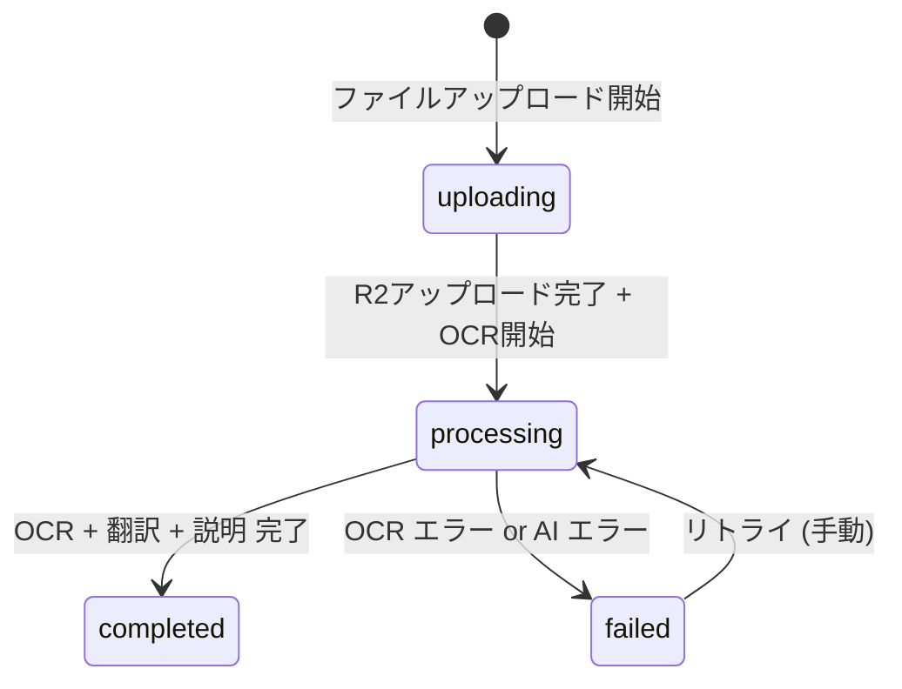
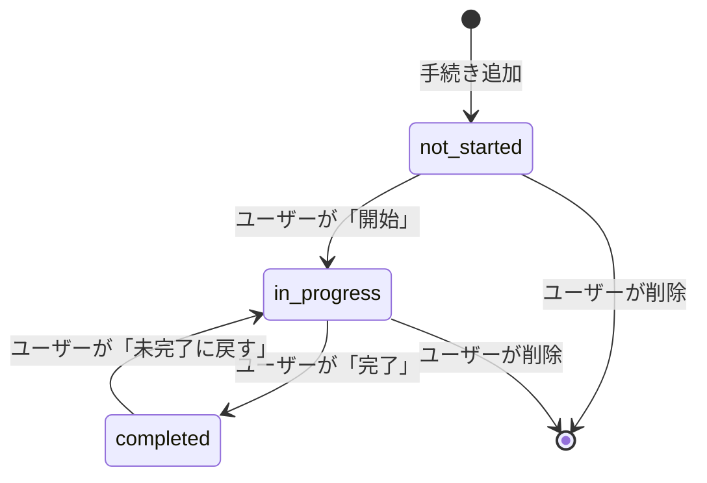

# 業務ルールと検証

## 1. 共通ルール

### 認証要件

- `/api/v1/auth/*`, `/api/v1/health`, `/api/v1/banking/banks`, `/api/v1/subscriptions/plans` 以外の全 API エンドポイントは認証必須
- JWT は Firebase Auth が発行（ID Token）。有効期限 1 時間。Flutter クライアントは `firebase_auth` パッケージで自動リフレッシュを行う
- CF Workers の Edge で Firebase 公開鍵を使用して RS256 JWT 検証 → 無効な場合は 401 を即返却（バックエンドに到達させない）

### データ隔離

- 全ユーザーデータはアプリケーション層（FastAPI）で `user_id = current_firebase_uid` を検証して制限
- マスターデータ（banking_guides, visa_procedures, admin_procedures, medical_phrases, knowledge_sources）は全ユーザーに読み取り許可
- マスターデータの変更は管理者のみ許可（Firebase Admin SDK のカスタムクレーム `admin: true` で検証）

### ソフトデリート

- 対象テーブル: profiles, chat_sessions, document_scans, community_posts, community_replies, user_procedures
- `deleted_at IS NOT NULL` のレコードは全 API レスポンスから除外
- 物理削除は行わない（法的保持要件。GDPR データ削除要求時のみ物理削除を実施）

### 多言語 JSONB バリデーション

- 多言語フィールド (jsonb) は以下の 5 キーを必須とする: `en`, `zh`, `vi`, `ko`, `pt`
- 欠損キーがある場合、API は `en` の値をフォールバックとして使用
- `lang` クエリパラメータで指定された言語のみを文字列として返却（JSONB をそのまま返さない）

---

## 2. サブスクリプションティア制限

### ⚠️ 本セクションが制限値の SSOT — フロントもバックエンドもこの値を参照

| 機能 | Free | Premium (¥500/月) | Premium+ (¥1,500/月) |
|------|------|------|------|
| AI チャット | **5 回/日** | 無制限 | 無制限 |
| Document Scanner | **3 枚/月** | 30 枚/月 | 無制限 |
| Admin Tracker 登録数 | **3 件** | 無制限 | 無制限 |
| Community Q&A 閲覧 | ✅ | ✅ | ✅ |
| Community Q&A 投稿・返信・投票 | ❌ | ✅ | ✅ |
| Visa Navigator パーソナライズ | ❌ (基本情報のみ) | ✅ | ✅ |
| 広告表示 | あり | なし | なし |
| Banking Navigator | ✅ (全機能) | ✅ | ✅ |
| Medical Guide (静的) | ✅ | ✅ | ✅ |

### 制限チェックのフロー

```
リクエスト受信
  ↓
JWT からユーザー ID 取得
  ↓
profiles.subscription_tier 取得
  ↓
tier == 'free' の場合:
  ├── AI Chat: daily_usage.chat_count >= 5 → 403 TIER_LIMIT_EXCEEDED
  ├── Doc Scan: daily_usage.scan_count_monthly >= 3 → 403 TIER_LIMIT_EXCEEDED
  ├── Admin Tracker: user_procedures の active 件数 >= 3 → 403 TIER_LIMIT_EXCEEDED
  └── Community 投稿/返信/投票 → 403 TIER_LIMIT_EXCEEDED
tier == 'premium' の場合:
  └── Doc Scan: scan_count_monthly >= 30 → 403 TIER_LIMIT_EXCEEDED
tier == 'premium_plus' の場合:
  └── 制限なし
```

### 日次 / 月次カウントのリセット

- **AI チャット日次カウント**: `daily_usage` テーブル。`usage_date` ごとにレコード。翌日は新しいレコードが作成されるため自動リセット
- **Doc Scanner 月次カウント**: `daily_usage.scan_count_monthly` は毎月 1 日にリセット。リセットは API 側で `usage_date` の月を判定して行う（バッチジョブ不要）
  - 具体的: API が `scan_count_monthly` を読む際、レコードの月と現在月が異なれば 0 として扱う

### 制限超過時の API レスポンス

```json
{
  "error": {
    "code": "TIER_LIMIT_EXCEEDED",
    "message": "You have reached the daily limit for AI chat. Upgrade to Premium for unlimited access.",
    "details": {
      "feature": "ai_chat",
      "current_count": 5,
      "limit": 5,
      "tier": "free",
      "upgrade_url": "/subscription"
    }
  }
}
```

---

## 3. AI チャットルール

### システムプロンプト構成

```
[System Prompt]
You are a multilingual life concierge AI for foreign residents in Japan.
Your role is to help users with daily life procedures, visa matters, banking,
medical care, and other challenges they face living in Japan.

RULES:
1. Always respond in the user's language (detected from input).
2. Base your answers on the provided context (RAG results).
3. Always cite your sources with URLs when available.
4. If unsure, say so clearly - never make up information.
5. For legal/visa matters, always include the disclaimer.
6. Provide actionable next steps when possible.
7. Be culturally sensitive and encouraging.

USER PROFILE:
- Nationality: {nationality}
- Residence Status: {residence_status}
- Region: {residence_region}
- Preferred Language: {preferred_language}

CONTEXT (from knowledge base):
{rag_results}

CONVERSATION HISTORY:
{last_10_messages}
```

### RAG パイプライン

1. ユーザーメッセージを受信
2. 意図分類 (Claude call): `category` を判定（banking/visa/medical/admin/housing/work/daily_life/general）
3. セッションの `category` を更新（初回のみ）
4. セッションの `title` を生成（初回のみ、Claude call）
5. ユーザーメッセージを Embedding 変換（text-embedding-3-small）
6. Pinecone で類似度検索（top-5、`category` でフィルタ）
7. 取得した chunks + ユーザープロフィール + 会話履歴（直近 10 メッセージ）を Claude に送信
8. ストリーミングレスポンスを SSE で返却
9. 完了後、user メッセージと assistant メッセージの両方を DB に保存
10. `daily_usage.chat_count` をインクリメント

### トークン制限

| 項目 | 値 |
|------|-----|
| ユーザーメッセージ最大長 | 2,000 文字 |
| コンテキストウィンドウに含める履歴 | 直近 10 メッセージ |
| RAG chunks | 最大 5 件 |
| 最大出力トークン | 2,000 tokens |
| 1 回の推定消費 | 入力 ~1,500 tokens + 出力 ~500 tokens = ~2,000 tokens |

---

## 4. コミュニティ Q&A ルール

### AI モデレーション

投稿・返信の作成時に非同期で AI モデレーションを実行:

```
投稿/返信作成
  ↓
DB に保存 (ai_moderation_status = 'pending')
  ↓
非同期: Claude API に送信
  prompt: "Evaluate this community post for:
    1. Harmful/hateful content
    2. Spam or self-promotion
    3. Dangerous misinformation about legal/medical topics
    4. Personal information exposure
    Respond with: APPROVED or FLAGGED with reason."
  ↓
結果に応じて更新:
  APPROVED → ai_moderation_status = 'approved'
  FLAGGED → ai_moderation_status = 'flagged', ai_moderation_reason = "..."
```

### 表示ルール

- `pending`: 投稿者本人には表示、他ユーザーには非表示
- `approved`: 全ユーザーに表示
- `flagged`: 投稿者本人には「レビュー中」として表示、他ユーザーには非表示。月次で手動レビュー（管理スクリプト or DB 直接操作）
- `rejected`: 非表示（API クエリで除外）

### ベストアンサー

- 投稿者のみがベストアンサーを設定可能
- 1 投稿につきベストアンサーは 1 つ（既存のベストアンサーを解除して新しいものを設定可能）
- ベストアンサー設定時: `community_posts.is_answered = true` に更新

### 投票

- 1 ユーザー 1 投稿/返信につき 1 票（UNIQUE 制約）
- 再度投票 → 取消（トグル動作）
- `upvote_count` は投票の INSERT/DELETE 時にトリガーで更新（カウンターキャッシュ）

### view_count

- 投稿詳細 API (`GET /api/v1/community/posts/:id`) の呼び出し時にインクリメント
- 同一ユーザーの連続閲覧は重複カウント（MVP ではユニークビュー追跡しない）

---

## 5. Document Scanner ルール

### 対応ファイル

| 項目 | 値 |
|------|-----|
| 対応形式 | JPEG, PNG, HEIC |
| 最大サイズ | 10 MB |
| 最大解像度 | 4096 x 4096 px |

### 処理フロー状態遷移



### OCR → AI 翻訳プロンプト

```
You are a document translator and explainer for foreign residents in Japan.

Given the following OCR text from a Japanese document:
{ocr_text}

The user's language is: {target_language}

Please provide:
1. document_type: Identify the type of document (e.g., pension_notice, tax_notice, resident_card, bank_statement, etc.)
2. translation: Translate the document content to the user's language
3. explanation: Explain what this document is, why the user received it, and what action they need to take

Format your response as JSON:
{"document_type": "...", "translation": "...", "explanation": "..."}
```

---

## 6. 免責事項ルール

### ⚠️ 以下の免責事項は省略不可 — 該当する全レスポンスに含めること

#### AI チャット（全レスポンス）

フッター（ストリーミング `message_end` イベントの `disclaimer` フィールド）:
```
This information is for general guidance only and does not constitute legal advice.
Please verify with relevant authorities for the most up-to-date information.
```
> ユーザーの言語で動的に翻訳して表示

#### Visa Navigator（全レスポンス）

```
IMPORTANT: This is general information about visa procedures and does not
constitute immigration advice. Immigration laws and procedures may change.
Always consult the Immigration Services Agency or a qualified immigration
lawyer (行政書士) for your specific situation.
```

#### Medical Guide（全レスポンス）

```
This guide provides general health information and is not a substitute
for professional medical advice. In an emergency, call 119 immediately.
```

### 免責事項の実装方法

- AI チャット: システムプロンプトに免責事項生成を指示 + API レスポンスの `disclaimer` フィールドにハードコード
- Visa Navigator / Medical Guide: API レスポンスに `disclaimer` フィールドとして必ず含める
- フロントエンド: `disclaimer` フィールドが存在する場合、レスポンスの末尾に表示するコンポーネントを共通化

---

## 7. Banking Navigator ルール

### レコメンドスコア計算

```python
def calculate_match_score(bank: BankingGuide, user: UserProfile, priorities: list[str]) -> int:
    """
    銀行レコメンドスコアを計算する。
    スコア: 0-100
    """
    score = 0
    reasons = []
    warnings = []

    # 基本スコア: 外国人対応度 (0-40点)
    score += bank.foreigner_friendly_score * 8  # 1-5 → 8-40

    # 多言語対応 (0-20点)
    user_lang = user.preferred_language
    if user_lang in bank.multilingual_support:
        score += 20
        reasons.append(f"Supports {user_lang}")
    elif 'en' in bank.multilingual_support:
        score += 10
        reasons.append("English support available")

    # 優先条件ボーナス (各0-10点, 最大40点)
    if 'low_fee' in priorities and bank.features.get('monthly_fee', 0) == 0:
        score += 10
        reasons.append("No monthly fee")
    if 'atm' in priorities and bank.features.get('atm_count', 0) > 5000:
        score += 10
        reasons.append("Extensive ATM network")
    if 'online' in priorities and bank.features.get('online_banking'):
        score += 10
        reasons.append("Full online banking")
    if 'multilingual' in priorities and len(bank.multilingual_support) >= 3:
        score += 10
        reasons.append("Multilingual support")

    # 警告チェック
    min_stay = bank.requirements.get('min_stay_months', 0)
    if min_stay > 0 and user.arrival_date:
        months_in_japan = (date.today() - user.arrival_date).days // 30
        if months_in_japan < min_stay:
            warnings.append(f"May require {min_stay} months residence")

    return min(score, 100), reasons, warnings
```

### ⚠️ スコア計算は SSOT — Coder は本公式をそのまま実装すること

---

## 8. Admin Tracker ルール

### 来日直後の必須手続き（初期チェックリスト）

オンボーディング完了時、以下の5手続きを自動で `user_procedures` に追加する:

| # | 手続き | 期限ルール | 説明 |
|---|--------|-----------|------|
| 1 | 住民登録 (resident_registration) | 来日後 14 日以内 | 市区町村役場で転入届 |
| 2 | 在留カード住所変更 (address_update) | 住民登録と同時 | 在留カード裏面に住所記載 |
| 3 | 国民健康保険加入 (health_insurance) | 住民登録と同時 | 社会保険未加入の場合 |
| 4 | 国民年金加入 (national_pension) | 住民登録と同時 | 20歳以上の場合 |
| 5 | 銀行口座開設 (bank_account) | できるだけ早く | 給与受取に必要 |

### 期限計算ロジック

```python
def calculate_due_date(procedure: AdminProcedure, user: UserProfile) -> date | None:
    """手続きテンプレートの deadline_rule とユーザーの arrival_date から期限を計算"""
    rule = procedure.deadline_rule
    if rule is None or user.arrival_date is None:
        return None

    if rule['type'] == 'within_days_of_arrival':
        return user.arrival_date + timedelta(days=rule['days'])

    if rule['type'] == 'before_expiry':
        # ビザ期限は別途入力が必要 → 未実装 (NULL 返却)
        return None

    return None
```

### 状態遷移



- 完了時: `completed_at = now()` を記録
- 未完了に戻す時: `completed_at = NULL` にリセット

---

## 9. サブスクリプションルール

### Stripe Webhook 処理

| イベント | 処理 |
|---------|------|
| `checkout.session.completed` | subscriptions レコード作成、profiles.subscription_tier 更新 |
| `customer.subscription.updated` | subscriptions.status + tier + period 更新、profiles.subscription_tier 同期 |
| `customer.subscription.deleted` | subscriptions.status = 'expired'、profiles.subscription_tier = 'free' |
| `invoice.payment_failed` | subscriptions.status = 'past_due' |
| `invoice.payment_succeeded` | subscriptions.status = 'active'（past_due からの復帰） |

### 課金のタイミング

- Stripe Checkout で即時課金（初回）
- 以降は Stripe が自動で期間更新 + 課金
- キャンセル: `cancel_at_period_end = true` → 期間終了時に Stripe が `customer.subscription.deleted` を送信

### Tier 変更時の動作

- Free → Premium: 即座に Premium 機能を開放
- Premium → Premium+: 即座にアップグレード（Stripe proration で差額計算）
- Premium → Free (キャンセル): 期間終了まで Premium を維持
- Premium+ → Premium: ダウングレードは次回更新時に反映

---

## 10. Rate Limiting ルール（CF Workers）

| 対象 | 制限 | ウィンドウ |
|------|------|-----------|
| 全 API (認証済み) | 60 req/min | Sliding window |
| 全 API (未認証) | 20 req/min | Sliding window |
| AI Chat 送信 | ティアによる (§2) | 日次 |
| Auth (login/register) | 5 req/min per IP | Fixed window |
| Doc Scanner | ティアによる (§2) | 月次 |

超過時: 429 `RATE_LIMITED` を返却、`Retry-After` ヘッダーを付与。
