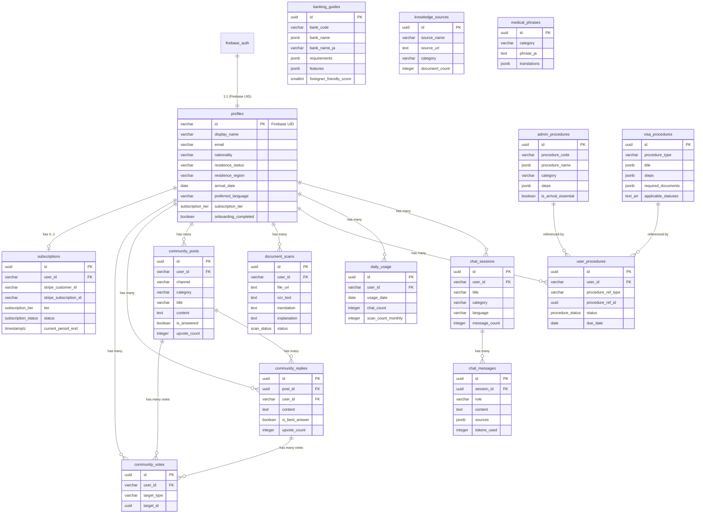

# データモデル（MVP, 最小可用）

> 本文書は論理モデル。サーバー側は PostgreSQL 15+ で実装する。
> クライアント側は drift (SQLite) でキャッシュ用のサブセットを保持する（see DECISIONS.md §4 鉄則 10）。
> 認証は Firebase Auth が管理する。アプリ固有のプロフィールは `profiles` テーブルに格納。

## 共通フィールド

- `id`: UUID (PK), UUID v4 生成
- `created_at`: timestamptz, NOT NULL, DEFAULT `now()`
- `updated_at`: timestamptz, NOT NULL, DEFAULT `now()`（トリガーまたはアプリ層で自動更新）

ソフトデリート対象テーブルには追加:
- `deleted_at`: timestamptz, NULLable

## 共通型定義

```sql
-- 多言語 JSONB の構造（5言語必須）
-- {"en": "...", "zh": "...", "vi": "...", "ko": "...", "pt": "..."}
-- 型チェックは BUSINESS_RULES.md §1 に定義

-- subscription_tier enum
CREATE TYPE subscription_tier AS ENUM ('free', 'premium', 'premium_plus');

-- procedure_status enum
CREATE TYPE procedure_status AS ENUM ('not_started', 'in_progress', 'completed');

-- scan_status enum
CREATE TYPE scan_status AS ENUM ('uploading', 'processing', 'completed', 'failed');

-- moderation_status enum
CREATE TYPE moderation_status AS ENUM ('pending', 'approved', 'flagged', 'rejected');

-- subscription_status enum
CREATE TYPE subscription_status AS ENUM ('active', 'cancelled', 'past_due', 'expired');
```

## 認可方針

Firebase Auth は RLS (Row Level Security) を提供しないため、**全データアクセスの認可はアプリケーション層（FastAPI）で enforce** する:

- ユーザーデータ: API ハンドラーで `WHERE user_id = :current_user_id` を必須とする
- マスターデータ（banking_guides 等）: 読み取りは全ユーザー許可。変更は管理用スクリプトのみ
- 管理操作: Firebase Admin SDK でカスタムクレーム `admin: true` を設定し、API 層で検証

---

## 1. profiles

> Firebase Auth のユーザーと 1:1 対応。ユーザーのアプリ固有情報。

| フィールド | 型 | 制約 | デフォルト | 説明 |
|-----------|------|------|-----------|------|
| id | varchar(128) | PK | — | Firebase Auth の UID |
| display_name | varchar(100) | NOT NULL | '' | 表示名 |
| email | varchar(255) | UNIQUE, NOT NULL | — | Firebase Auth から同期 |
| avatar_url | text | NULLable | NULL | プロフィール画像 URL (R2) |
| nationality | varchar(2) | NULLable | NULL | ISO 3166-1 alpha-2 (例: 'CN', 'VN') |
| residence_status | varchar(50) | NULLable | NULL | 在留資格コード (後述 ENUM 参照) |
| residence_region | varchar(10) | NULLable | NULL | 都道府県コード (例: '13' = 東京) |
| arrival_date | date | NULLable | NULL | 来日日 |
| preferred_language | varchar(5) | NOT NULL | 'en' | UI 言語 (en/zh/vi/ko/pt) |
| subscription_tier | subscription_tier | NOT NULL | 'free' | 現在の課金ティア |
| onboarding_completed | boolean | NOT NULL | false | オンボーディング完了フラグ |
| created_at | timestamptz | NOT NULL | now() | |
| updated_at | timestamptz | NOT NULL | now() | |
| deleted_at | timestamptz | NULLable | NULL | ソフトデリート |

**在留資格コード (residence_status の許容値)**:
`engineer_specialist`, `specified_skilled_1`, `specified_skilled_2`, `student`, `permanent_resident`, `spouse_of_japanese`, `long_term_resident`, `technical_intern`, `business_manager`, `highly_skilled_professional`, `dependent`, `designated_activities`, `other`

**認可**: API 層で `id = current_firebase_uid` を検証

---

## 2. chat_sessions

| フィールド | 型 | 制約 | デフォルト | 説明 |
|-----------|------|------|-----------|------|
| id | UUID | PK | UUID v4 | |
| user_id | varchar(128) | FK → profiles(id), NOT NULL | — | セッション所有者 |
| title | varchar(200) | NULLable | NULL | AI が自動生成 |
| category | varchar(30) | NOT NULL | 'general' | general/banking/visa/medical/admin/housing/work/daily_life |
| language | varchar(5) | NOT NULL | 'en' | セッションの主要言語 |
| message_count | integer | NOT NULL | 0 | メッセージ数 |
| created_at | timestamptz | NOT NULL | now() | |
| updated_at | timestamptz | NOT NULL | now() | |
| deleted_at | timestamptz | NULLable | NULL | |

**インデックス**:
- `idx_chat_sessions_user_id` ON (user_id) WHERE deleted_at IS NULL
- `idx_chat_sessions_updated_at` ON (user_id, updated_at DESC) WHERE deleted_at IS NULL

**認可**: API 層で `user_id = current_firebase_uid` を検証

---

## 3. chat_messages

| フィールド | 型 | 制約 | デフォルト | 説明 |
|-----------|------|------|-----------|------|
| id | UUID | PK | UUID v4 | |
| session_id | UUID | FK → chat_sessions(id), NOT NULL | — | 所属セッション |
| role | varchar(10) | NOT NULL | — | 'user' / 'assistant' |
| content | text | NOT NULL | — | メッセージ本文 |
| sources | jsonb | NULLable | NULL | AI 回答のソース引用 `[{"title":"...","url":"..."}]` |
| tokens_used | integer | NOT NULL | 0 | 消費トークン数（input + output） |
| created_at | timestamptz | NOT NULL | now() | |

**インデックス**:
- `idx_chat_messages_session_id` ON (session_id, created_at ASC)

**認可**: 親の chat_sessions.user_id 経由で検証

---

## 4. daily_usage

> Free ティアの日次/月次制限を追跡。

| フィールド | 型 | 制約 | デフォルト | 説明 |
|-----------|------|------|-----------|------|
| id | UUID | PK | UUID v4 | |
| user_id | varchar(128) | FK → profiles(id), NOT NULL | — | |
| usage_date | date | NOT NULL | CURRENT_DATE | 利用日 |
| chat_count | integer | NOT NULL | 0 | 当日の AI チャット回数 |
| scan_count_monthly | integer | NOT NULL | 0 | 当月の Doc Scanner 利用回数 |
| created_at | timestamptz | NOT NULL | now() | |
| updated_at | timestamptz | NOT NULL | now() | |

**ユニーク制約**: `UNIQUE(user_id, usage_date)`

**認可**: API 層で `user_id = current_firebase_uid` を検証

---

## 5. banking_guides

> 銀行口座開設ガイドのマスターデータ（管理者が登録）。

| フィールド | 型 | 制約 | デフォルト | 説明 |
|-----------|------|------|-----------|------|
| id | UUID | PK | UUID v4 | |
| bank_code | varchar(20) | UNIQUE, NOT NULL | — | 銀行識別コード (例: 'mufg', 'smbc') |
| bank_name | jsonb | NOT NULL | — | 多言語銀行名 `{"en":"...","zh":"...","vi":"...","ko":"...","pt":"..."}` |
| bank_name_ja | varchar(100) | NOT NULL | — | 日本語正式名称 |
| logo_url | text | NULLable | NULL | ロゴ画像 URL |
| multilingual_support | jsonb | NOT NULL | '[]' | 対応言語リスト `["en","zh"]` |
| requirements | jsonb | NOT NULL | '{}' | 開設要件 `{"min_stay_months":6,"residence_card":true,...}` |
| features | jsonb | NOT NULL | '{}' | 特徴 `{"atm_count":..., "monthly_fee":..., "online_banking":true}` |
| foreigner_friendly_score | smallint | NOT NULL, CHECK(1-5) | 3 | 外国人対応度 (1-5) |
| application_url | text | NULLable | NULL | オンライン申込 URL |
| conversation_templates | jsonb | NULLable | NULL | 窓口会話テンプレート（多言語） |
| troubleshooting | jsonb | NULLable | NULL | トラブルシューティング（多言語） |
| sort_order | smallint | NOT NULL | 0 | 表示順 |
| is_active | boolean | NOT NULL | true | 表示フラグ |
| created_at | timestamptz | NOT NULL | now() | |
| updated_at | timestamptz | NOT NULL | now() | |

**認可**: SELECT は全ユーザー。変更は管理者のみ。

---

## 6. visa_procedures

> ビザ手続きテンプレートのマスターデータ。

| フィールド | 型 | 制約 | デフォルト | 説明 |
|-----------|------|------|-----------|------|
| id | UUID | PK | UUID v4 | |
| procedure_type | varchar(30) | NOT NULL | — | renewal/change/permanent/reentry/work_permit/family |
| title | jsonb | NOT NULL | — | 多言語タイトル |
| description | jsonb | NOT NULL | — | 多言語説明 |
| required_documents | jsonb | NOT NULL | '[]' | 必要書類リスト `[{"name":{"en":"..."},"how_to_get":{"en":"..."}}]` |
| steps | jsonb | NOT NULL | '[]' | 手続きステップ `[{"order":1,"title":{"en":"..."},"description":{"en":"..."}}]` |
| estimated_duration | varchar(50) | NULLable | NULL | 所要期間 (例: '2-4 weeks') |
| fees | jsonb | NULLable | NULL | 費用情報 `{"application_fee":4000,"stamp_fee":...}` |
| applicable_statuses | text[] | NOT NULL | '{}' | 対象在留資格コード配列 |
| deadline_rule | jsonb | NULLable | NULL | 期限ルール `{"type":"before_expiry","months":3}` |
| tips | jsonb | NULLable | NULL | 多言語 Tips |
| is_active | boolean | NOT NULL | true | |
| sort_order | smallint | NOT NULL | 0 | |
| created_at | timestamptz | NOT NULL | now() | |
| updated_at | timestamptz | NOT NULL | now() | |

**インデックス**:
- `idx_visa_procedures_type` ON (procedure_type) WHERE is_active = true

**認可**: SELECT は全ユーザー。変更は管理者のみ。

---

## 7. admin_procedures

> 行政手続きテンプレートのマスターデータ。

| フィールド | 型 | 制約 | デフォルト | 説明 |
|-----------|------|------|-----------|------|
| id | UUID | PK | UUID v4 | |
| procedure_code | varchar(30) | UNIQUE, NOT NULL | — | 手続き識別コード (例: 'resident_registration') |
| procedure_name | jsonb | NOT NULL | — | 多言語名称 |
| category | varchar(30) | NOT NULL | — | arrival/residence/tax/insurance/pension |
| description | jsonb | NOT NULL | — | 多言語説明 |
| required_documents | jsonb | NOT NULL | '[]' | 必要書類リスト |
| steps | jsonb | NOT NULL | '[]' | 手続きステップ |
| deadline_rule | jsonb | NULLable | NULL | 期限ルール `{"type":"within_days_of_arrival","days":14}` |
| office_info | jsonb | NULLable | NULL | 窓口情報 `{"name":{"en":"..."},"typical_hours":"9:00-17:00"}` |
| tips | jsonb | NULLable | NULL | 多言語 Tips |
| is_arrival_essential | boolean | NOT NULL | false | 来日直後の必須手続きか |
| sort_order | smallint | NOT NULL | 0 | |
| is_active | boolean | NOT NULL | true | |
| created_at | timestamptz | NOT NULL | now() | |
| updated_at | timestamptz | NOT NULL | now() | |

**インデックス**:
- `idx_admin_procedures_category` ON (category) WHERE is_active = true
- `idx_admin_procedures_arrival` ON (is_arrival_essential) WHERE is_active = true AND is_arrival_essential = true

**認可**: SELECT は全ユーザー。変更は管理者のみ。

---

## 8. user_procedures

> ユーザーが追跡中の手続き（Admin Tracker）。

| フィールド | 型 | 制約 | デフォルト | 説明 |
|-----------|------|------|-----------|------|
| id | UUID | PK | UUID v4 | |
| user_id | varchar(128) | FK → profiles(id), NOT NULL | — | |
| procedure_ref_type | varchar(10) | NOT NULL | — | 'admin' / 'visa' |
| procedure_ref_id | UUID | NOT NULL | — | admin_procedures.id or visa_procedures.id |
| status | procedure_status | NOT NULL | 'not_started' | |
| due_date | date | NULLable | NULL | ユーザー設定の期限 |
| notes | text | NULLable | NULL | ユーザーメモ |
| completed_at | timestamptz | NULLable | NULL | 完了日時 |
| created_at | timestamptz | NOT NULL | now() | |
| updated_at | timestamptz | NOT NULL | now() | |
| deleted_at | timestamptz | NULLable | NULL | |

**インデックス**:
- `idx_user_procedures_user_id` ON (user_id) WHERE deleted_at IS NULL
- `idx_user_procedures_status` ON (user_id, status) WHERE deleted_at IS NULL

**認可**: API 層で `user_id = current_firebase_uid` を検証

---

## 9. document_scans

| フィールド | 型 | 制約 | デフォルト | 説明 |
|-----------|------|------|-----------|------|
| id | UUID | PK | UUID v4 | |
| user_id | varchar(128) | FK → profiles(id), NOT NULL | — | |
| file_url | text | NOT NULL | — | R2 上の画像 URL |
| file_name | varchar(255) | NOT NULL | — | 元ファイル名 |
| file_size_bytes | integer | NOT NULL | — | ファイルサイズ |
| ocr_text | text | NULLable | NULL | OCR 結果（日本語） |
| translation | text | NULLable | NULL | AI 翻訳結果 |
| explanation | text | NULLable | NULL | AI による内容説明 |
| document_type | varchar(50) | NULLable | NULL | AI 推定の書類種別 (resident_card/pension_notice/...) |
| source_language | varchar(5) | NOT NULL | 'ja' | 元言語 |
| target_language | varchar(5) | NOT NULL | — | 翻訳先言語 |
| status | scan_status | NOT NULL | 'uploading' | |
| error_message | text | NULLable | NULL | エラー時のメッセージ |
| created_at | timestamptz | NOT NULL | now() | |
| updated_at | timestamptz | NOT NULL | now() | |
| deleted_at | timestamptz | NULLable | NULL | |

**インデックス**:
- `idx_document_scans_user_id` ON (user_id, created_at DESC) WHERE deleted_at IS NULL

**認可**: API 層で `user_id = current_firebase_uid` を検証

---

## 10. community_posts

| フィールド | 型 | 制約 | デフォルト | 説明 |
|-----------|------|------|-----------|------|
| id | UUID | PK | UUID v4 | |
| user_id | varchar(128) | FK → profiles(id), NOT NULL | — | 投稿者 |
| channel | varchar(5) | NOT NULL | — | 言語チャンネル (en/zh/vi/ko/pt) |
| category | varchar(30) | NOT NULL | — | banking/visa/medical/housing/work/daily_life |
| title | varchar(200) | NOT NULL | — | 投稿タイトル |
| content | text | NOT NULL | — | 投稿本文 |
| is_answered | boolean | NOT NULL | false | ベストアンサーありか |
| view_count | integer | NOT NULL | 0 | |
| upvote_count | integer | NOT NULL | 0 | |
| reply_count | integer | NOT NULL | 0 | |
| ai_moderation_status | moderation_status | NOT NULL | 'pending' | AI モデレーション状態 |
| ai_moderation_reason | text | NULLable | NULL | フラグ理由 |
| created_at | timestamptz | NOT NULL | now() | |
| updated_at | timestamptz | NOT NULL | now() | |
| deleted_at | timestamptz | NULLable | NULL | |

**インデックス**:
- `idx_community_posts_channel` ON (channel, category, created_at DESC) WHERE deleted_at IS NULL AND ai_moderation_status != 'rejected'
- `idx_community_posts_user_id` ON (user_id) WHERE deleted_at IS NULL

**認可**:
- SELECT: `ai_moderation_status != 'rejected'` をクエリ条件に含める（rejected は非表示）
- INSERT/UPDATE/DELETE: `user_id = current_firebase_uid` を検証

---

## 11. community_replies

| フィールド | 型 | 制約 | デフォルト | 説明 |
|-----------|------|------|-----------|------|
| id | UUID | PK | UUID v4 | |
| post_id | UUID | FK → community_posts(id), NOT NULL | — | 親投稿 |
| user_id | varchar(128) | FK → profiles(id), NOT NULL | — | 返信者 |
| content | text | NOT NULL | — | 返信本文 |
| is_best_answer | boolean | NOT NULL | false | |
| upvote_count | integer | NOT NULL | 0 | |
| ai_moderation_status | moderation_status | NOT NULL | 'pending' | |
| ai_moderation_reason | text | NULLable | NULL | |
| created_at | timestamptz | NOT NULL | now() | |
| updated_at | timestamptz | NOT NULL | now() | |
| deleted_at | timestamptz | NULLable | NULL | |

**インデックス**:
- `idx_community_replies_post_id` ON (post_id, created_at ASC) WHERE deleted_at IS NULL AND ai_moderation_status != 'rejected'

**認可**: SELECT は rejected 以外。INSERT/UPDATE/DELETE は `user_id = current_firebase_uid`。

---

## 12. community_votes

| フィールド | 型 | 制約 | デフォルト | 説明 |
|-----------|------|------|-----------|------|
| id | UUID | PK | UUID v4 | |
| user_id | varchar(128) | FK → profiles(id), NOT NULL | — | 投票者 |
| target_type | varchar(10) | NOT NULL | — | 'post' / 'reply' |
| target_id | UUID | NOT NULL | — | community_posts.id or community_replies.id |
| created_at | timestamptz | NOT NULL | now() | |

**ユニーク制約**: `UNIQUE(user_id, target_type, target_id)`

**認可**: INSERT/DELETE は `user_id = current_firebase_uid`。

---

## 13. subscriptions

| フィールド | 型 | 制約 | デフォルト | 説明 |
|-----------|------|------|-----------|------|
| id | UUID | PK | UUID v4 | |
| user_id | varchar(128) | FK → profiles(id), UNIQUE, NOT NULL | — | 1 ユーザー 1 サブスク |
| stripe_customer_id | varchar(100) | NOT NULL | — | Stripe Customer ID |
| stripe_subscription_id | varchar(100) | NULLable | NULL | Stripe Subscription ID |
| tier | subscription_tier | NOT NULL | 'premium' | premium / premium_plus |
| status | subscription_status | NOT NULL | 'active' | |
| current_period_start | timestamptz | NOT NULL | — | 現在の課金期間開始 |
| current_period_end | timestamptz | NOT NULL | — | 現在の課金期間終了 |
| cancel_at_period_end | boolean | NOT NULL | false | 期間終了時にキャンセルするか |
| cancelled_at | timestamptz | NULLable | NULL | キャンセル日時 |
| created_at | timestamptz | NOT NULL | now() | |
| updated_at | timestamptz | NOT NULL | now() | |

**認可**: SELECT は `user_id = current_firebase_uid`。INSERT/UPDATE は Stripe Webhook ハンドラー（バックエンド内部）のみ。

---

## 14. knowledge_sources

> RAG ナレッジベースのソース管理メタデータ。

| フィールド | 型 | 制約 | デフォルト | 説明 |
|-----------|------|------|-----------|------|
| id | UUID | PK | UUID v4 | |
| source_name | varchar(100) | UNIQUE, NOT NULL | — | ソース名 (例: 'ISA Portal') |
| source_url | text | NOT NULL | — | ソース URL |
| category | varchar(30) | NOT NULL | — | admin/visa/banking/medical/insurance/pension/community |
| description | text | NULLable | NULL | ソースの説明 |
| document_count | integer | NOT NULL | 0 | 登録ドキュメント数 |
| last_synced_at | timestamptz | NULLable | NULL | 最終同期日時 |
| sync_status | varchar(20) | NOT NULL | 'pending' | pending/syncing/completed/error |
| created_at | timestamptz | NOT NULL | now() | |
| updated_at | timestamptz | NOT NULL | now() | |

**認可**: SELECT は全ユーザー（メタデータのみ公開）。変更は管理者のみ。

---

## 15. medical_phrases

> Medical Guide の症状翻訳フレーズ集（静的コンテンツ）。

| フィールド | 型 | 制約 | デフォルト | 説明 |
|-----------|------|------|-----------|------|
| id | UUID | PK | UUID v4 | |
| category | varchar(30) | NOT NULL | — | symptom/emergency/insurance/general |
| phrase_ja | text | NOT NULL | — | 日本語フレーズ |
| phrase_reading | text | NULLable | NULL | ふりがな |
| translations | jsonb | NOT NULL | — | 多言語翻訳 `{"en":"...","zh":"...","vi":"...","ko":"...","pt":"..."}` |
| context | jsonb | NULLable | NULL | 使用場面の説明（多言語） |
| sort_order | smallint | NOT NULL | 0 | |
| is_active | boolean | NOT NULL | true | |
| created_at | timestamptz | NOT NULL | now() | |
| updated_at | timestamptz | NOT NULL | now() | |

**認可**: SELECT は全ユーザー。変更は管理者のみ。

---

## drift (SQLite) クライアントキャッシュ対象

Flutter アプリの drift ローカル DB に保持するキャッシュテーブル:

| テーブル | 用途 | 同期方針 |
|---------|------|---------|
| `cached_profiles` | ユーザープロフィール | ログイン時 + API 更新時に同期 |
| `cached_chat_sessions` | セッション一覧 | 一覧取得時にキャッシュ。オフライン時に表示 |
| `cached_banking_guides` | 銀行マスターデータ | 初回取得時にキャッシュ。24 時間毎に更新 |
| `cached_medical_phrases` | フレーズ集 | 初回取得時にキャッシュ。週次更新 |

> drift スキーマの詳細定義は実装フェーズで Coder が決定する。上記は対象テーブルの指針のみ。

---

## ER 図


