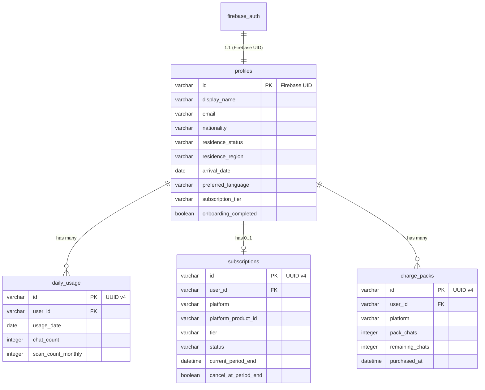

# データモデル（Phase 0, SQLite）

> 本文書は論理モデル。Phase 0 では **SQLite (aiosqlite)** で実装する。将来 PostgreSQL への移行を想定し、型定義は互換性を考慮。
> 認証は Firebase Auth が管理する。アプリ固有のプロフィールは `profiles` テーブルに格納。
> ナビゲーターコンテンツ（銀行ガイド、ビザ手続き等）は **knowledge ファイル** (svc-* agent の workspace/knowledge/*.md) で管理し、DB には格納しない。

## 共通フィールド

- `id`: VARCHAR(36) PK, UUID v4 文字列（SQLite 互換）
- `created_at`: DATETIME, NOT NULL, DEFAULT `CURRENT_TIMESTAMP`
- `updated_at`: DATETIME, NOT NULL, DEFAULT `CURRENT_TIMESTAMP`

ソフトデリート対象テーブルには追加:
- `deleted_at`: DATETIME, NULLable

## 型定義

```sql
-- Phase 0: SQLite のため ENUM 型は使用しない。VARCHAR + CHECK 制約で代替。

-- subscription_tier: 'free' | 'standard' | 'premium'
-- subscription_status: 'active' | 'cancelled' | 'past_due' | 'expired'
-- procedure_status: 'not_started' | 'in_progress' | 'completed'
```

## 認可方針

Firebase Auth は RLS を提供しないため、**全データアクセスの認可はアプリケーション層（FastAPI）で enforce** する:

- ユーザーデータ: API ハンドラーで `WHERE user_id = :current_user_id` を必須とする
- knowledge ファイルデータ（Navigator）: 全ユーザーに読み取り許可

---

## 1. profiles

> Firebase Auth のユーザーと 1:1 対応。ユーザーのアプリ固有情報。

| フィールド | 型 | 制約 | デフォルト | 説明 |
|-----------|------|------|-----------|------|
| id | VARCHAR(128) | PK | — | Firebase Auth の UID |
| display_name | VARCHAR(100) | NOT NULL | '' | 表示名 |
| email | VARCHAR(255) | UNIQUE, NOT NULL | — | Firebase Auth から同期 |
| avatar_url | TEXT | NULLable | NULL | プロフィール画像 URL |
| nationality | VARCHAR(2) | NULLable | NULL | ISO 3166-1 alpha-2 (例: 'CN', 'VN') |
| residence_status | VARCHAR(50) | NULLable | NULL | 在留資格コード (後述 ENUM 参照) |
| residence_region | VARCHAR(10) | NULLable | NULL | 都道府県コード (例: '13' = 東京) |
| arrival_date | DATE | NULLable | NULL | 来日日 |
| preferred_language | VARCHAR(5) | NOT NULL | 'en' | UI 言語 (en/zh/vi/ko/pt) |
| subscription_tier | VARCHAR(20) | NOT NULL | 'free' | 現在の課金ティア (free/standard/premium) |
| onboarding_completed | BOOLEAN | NOT NULL | false | オンボーディング完了フラグ |
| created_at | DATETIME | NOT NULL | CURRENT_TIMESTAMP | |
| updated_at | DATETIME | NOT NULL | CURRENT_TIMESTAMP | |
| deleted_at | DATETIME | NULLable | NULL | ソフトデリート |

**在留資格コード (residence_status の許容値)**:
`engineer_specialist`, `specified_skilled_1`, `specified_skilled_2`, `student`, `permanent_resident`, `spouse_of_japanese`, `long_term_resident`, `technical_intern`, `business_manager`, `highly_skilled_professional`, `dependent`, `designated_activities`, `other`

**認可**: API 層で `id = current_firebase_uid` を検証

---

## 2. daily_usage

> Free / Standard ティアの日次/月次制限を追跡。

| フィールド | 型 | 制約 | デフォルト | 説明 |
|-----------|------|------|-----------|------|
| id | VARCHAR(36) | PK | UUID v4 | |
| user_id | VARCHAR(128) | FK → profiles(id), NOT NULL | — | |
| usage_date | DATE | NOT NULL | CURRENT_DATE | 利用日 |
| chat_count | INTEGER | NOT NULL | 0 | 当日の AI チャット回数 |
| scan_count_monthly | INTEGER | NOT NULL | 0 | （将来用。Phase 0 では未使用） |
| created_at | DATETIME | NOT NULL | CURRENT_TIMESTAMP | |
| updated_at | DATETIME | NOT NULL | CURRENT_TIMESTAMP | |

**ユニーク制約**: `UNIQUE(user_id, usage_date)`

**利用制限の実装方式**:
- **Free (5回/日)**: `chat_count` を直接参照。翌日は新レコードが自動作成されるため自動リセット
- **Standard (300回/月)**: 月初から当日までの全 `chat_count` を SUM する。`_monthly_chat_count()` 関数で集計
- **Premium (無制限)**: インクリメントのみ（制限チェックなし）

**認可**: API 層で `user_id = current_firebase_uid` を検証

---

## 3. subscriptions

> IAP 購入履歴と有効サブスクリプション。1 ユーザー 1 サブスク。

| フィールド | 型 | 制約 | デフォルト | 説明 |
|-----------|------|------|-----------|------|
| id | VARCHAR(36) | PK | UUID v4 | |
| user_id | VARCHAR(128) | UNIQUE, NOT NULL | — | 1 ユーザー 1 サブスク |
| platform | VARCHAR(10) | NOT NULL | — | 'ios' / 'android' / 'stripe' |
| platform_product_id | VARCHAR(200) | NULLable | NULL | IAP product ID or Stripe price ID |
| platform_transaction_id | VARCHAR(200) | NULLable | NULL | IAP transaction ID or Stripe subscription ID |
| tier | VARCHAR(20) | NOT NULL | 'standard' | standard / premium |
| status | VARCHAR(20) | NOT NULL | 'active' | active / cancelled / past_due / expired |
| current_period_start | DATETIME | NOT NULL | — | 現在の課金期間開始 |
| current_period_end | DATETIME | NOT NULL | — | 現在の課金期間終了 |
| cancel_at_period_end | BOOLEAN | NOT NULL | false | 期間終了時にキャンセルするか |
| cancelled_at | DATETIME | NULLable | NULL | キャンセル日時 |
| created_at | DATETIME | NOT NULL | CURRENT_TIMESTAMP | |
| updated_at | DATETIME | NOT NULL | CURRENT_TIMESTAMP | |

**認可**: SELECT は `user_id = current_firebase_uid`。INSERT/UPDATE は IAP 検証ハンドラー（バックエンド内部）のみ。

---

## 4. charge_packs（従量チャージ）

> 従量チャージ購入履歴。

| フィールド | 型 | 制約 | デフォルト | 説明 |
|-----------|------|------|-----------|------|
| id | VARCHAR(36) | PK | UUID v4 | |
| user_id | VARCHAR(128) | FK → profiles(id), NOT NULL | — | |
| platform | VARCHAR(10) | NOT NULL | — | 'ios' / 'android' |
| pack_chats | INTEGER | NOT NULL | — | 購入回数 (50 or 100) |
| remaining_chats | INTEGER | NOT NULL | — | 残り回数 |
| purchased_at | DATETIME | NOT NULL | CURRENT_TIMESTAMP | |
| expires_at | DATETIME | NULLable | NULL | 有効期限（無期限なら NULL） |

---

## ~~Phase 0 ピボットで削除されたテーブル~~

以下のテーブルは Phase 0 ピボットで削除。機能は OpenClaw Runtime / knowledge files / AI Chat に統合。

| 旧テーブル | 代替先 | 理由 |
|-----------|--------|------|
| ~~chat_sessions~~ | OpenClaw session 管理 | `app_{uid}_{domain}` セッション ID で OpenClaw が管理 |
| ~~chat_messages~~ | OpenClaw session 履歴 | OpenClaw がメッセージ履歴を prompt cache で保持 |
| ~~document_scans~~ | AI Chat 画像入力 | Scanner 機能は AI Chat に統合 |
| ~~banking_guides~~ | svc-banking/workspace/knowledge/*.md | 知識ファイルで管理 |
| ~~visa_procedures~~ | svc-visa/workspace/knowledge/*.md | 知識ファイルで管理 |
| ~~admin_procedures~~ | svc-concierge/workspace/knowledge/*.md | 知識ファイルで管理 |
| ~~medical_phrases~~ | svc-medical/workspace/knowledge/*.md | 知識ファイルで管理 |
| ~~knowledge_sources~~ | Agent workspace メタデータ | ソース管理不要 |
| ~~community_posts~~ | — | Community 機能削除 |
| ~~community_replies~~ | — | Community 機能削除 |
| ~~community_votes~~ | — | Community 機能削除 |
| ~~user_procedures~~ | 将来検討 | Phase 0 では Tracker は AI Chat から提案のみ |

---

## drift (SQLite) クライアントキャッシュ対象

Flutter アプリの drift ローカル DB に保持するキャッシュテーブル:

| テーブル | 用途 | 同期方針 |
|---------|------|---------|
| `cached_profiles` | ユーザープロフィール | ログイン時 + API 更新時に同期 |
| `cached_usage` | 利用状況 | Chat 送信後に同期 |

> drift スキーマの詳細定義は実装フェーズで Coder が決定する。上記は対象テーブルの指針のみ。

---

## ER 図



---

## 変更履歴

- 2026-02-16: 初版作成
- 2026-02-17: Phase 0 アーキテクチャピボット反映（OC Runtime / memory_search / LLM routing / 課金体系更新）
