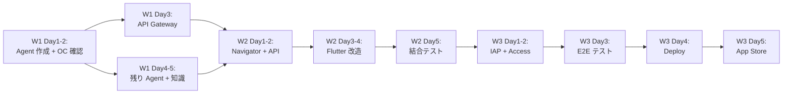

# 開発フェーズ（マイルストーン）

> **必ず順番通りに実装。** スキップ・一括実装は禁止。
> 各マイルストーンの受入基準を全てクリアしてから次へ進む。
> Phase 0 = 3 週間。Phase 1 = 追加 Agent + デプロイ。

---

## Phase 0: MVP（3 週間）

### Week 1: 基盤構築（E0 + E1）

#### Day 1-2: Service Agent 作成 + OC Runtime 確認

**範囲:**
- svc-concierge + svc-banking の Agent 作成
  - workspace/AGENTS.md + IDENTITY.md + SOUL.md + TOOLS.md
  - workspace/knowledge/ に知識ファイル配置
  - OpenClaw config に agent 追加（tool 制限: web_search, web_fetch, read, memory_search, memory_get）
- 動作確認: `openclaw agent --agent svc-banking --json` テスト
- Session 持続性テスト: 同一 session ID で連続会話

**含まれるストーリー:** —（インフラ準備）

**産出物:**
- `~/.openclaw/agents/svc-concierge/workspace/` — Agent workspace + knowledge/
- `~/.openclaw/agents/svc-banking/workspace/` — Agent workspace + knowledge/
- OpenClaw config 更新（tool 制限設定）

**検証方法:**
```bash
# Agent 呼び出しテスト
openclaw agent --agent svc-banking --session-id test_banking \
  --message "日本で銀行口座を開設するには？" --json --thinking low

# 期待: JSON レスポンス、3-5 秒、knowledge ベースの回答
```

**受入基準:**
- [ ] svc-concierge, svc-banking が `--json` で正常応答する
- [ ] memory_search が knowledge/ ファイルから関連情報を取得する
- [ ] tool 制限が機能する（exec, write 等が使用不可）
- [ ] Session 持続性: 同一 session ID で文脈が保持される

#### Day 3: API Gateway scaffold

**範囲:**
- FastAPI プロジェクト初期化
- Firebase Auth middleware（JWT 検証）
- Agent 呼び出し service (`services/agent.py`: subprocess → `openclaw agent --json`)
- POST /api/v1/chat endpoint
- SQLite DB 初期化（profiles, daily_usage テーブル）
- Usage service（ティア別制限チェック + インクリメント）

**含まれるストーリー:** US-001 (登録), US-002 (ログイン)

**産出物:**
- `backend/app_service/` — FastAPI プロジェクト
  - main.py, config.py, database.py
  - routers/chat.py, routers/auth.py, routers/health.py
  - services/agent.py, services/auth.py, services/usage.py
  - models/profile.py, models/daily_usage.py

**検証方法:**
```bash
cd backend/app_service && uvicorn main:app --reload
curl http://localhost:8000/api/v1/health  # {"status": "ok"}

# POST /api/v1/chat テスト（認証付き）
curl -X POST http://localhost:8000/api/v1/chat \
  -H "Authorization: Bearer {firebase_token}" \
  -H "Content-Type: application/json" \
  -d '{"message": "口座開設したい", "locale": "ja"}'
```

**受入基準:**
- [ ] FastAPI が起動し、health check が OK
- [ ] Firebase JWT 検証が動作する
- [ ] POST /api/v1/chat → Agent 呼び出し → 構造化レスポンス返却
- [ ] Free ティア 5回/日の制限が enforce される
- [ ] SQLite に profiles, daily_usage テーブルが作成される

#### Day 4-5: 残り Agent + 知識ファイル作成

**範囲:**
- svc-visa + svc-medical Agent 追加
- 全 4 agent の knowledge/ ディレクトリに知識 .md ファイル作成
- memory_search 動作確認（検索精度テスト）
- LLM ルーティング（svc-concierge による分類）の実装確認

**産出物:**
- `~/.openclaw/agents/svc-visa/workspace/` — Agent workspace + knowledge/
- `~/.openclaw/agents/svc-medical/workspace/` — Agent workspace + knowledge/

**受入基準:**
- [ ] 全 4 agent が正常に応答する
- [ ] Emergency keyword (119, 救急 等) で svc-medical に即座にルーティングされる
- [ ] LLM 分類で banking/visa/medical/concierge が正しく判定される
- [ ] memory_search が各 agent の knowledge/ から適切な情報を取得する

---

### Week 2: Navigator + Flutter 改造（E2 + E3）

#### Day 1-2: Navigator + Emergency + Subscription endpoints

**範囲:**
- Navigator API (GET /api/v1/navigator/*)
- Emergency API (GET /api/v1/emergency)
- Subscription plans API (GET /api/v1/subscription/plans)
- Usage API (GET /api/v1/usage)
- Profile API (GET/PATCH /api/v1/users/me, POST /api/v1/users/me/onboarding)

**含まれるストーリー:** US-201〜203 (Navigator), US-301 (Emergency), US-401 (Plans)

**産出物:**
- `backend/app_service/routers/navigator.py`
- `backend/app_service/routers/usage_router.py`
- `backend/app_service/routers/subscriptions.py`
- `backend/app_service/routers/profile_router.py`

**受入基準:**
- [ ] GET /api/v1/navigator/domains → 8 ドメイン (4 active + 4 coming_soon) 返却
- [ ] GET /api/v1/navigator/banking/guides → knowledge/*.md 一覧返却
- [ ] GET /api/v1/navigator/banking/guides/account-opening → ガイド全文返却
- [ ] GET /api/v1/emergency → 緊急連絡先 + ガイドコンテンツ返却
- [ ] GET /api/v1/subscription/plans → 3 プラン + 従量チャージ返却
- [ ] GET /api/v1/usage → ティア別利用状況返却

#### Day 3-4: Flutter 改造

**範囲:**
- Chat UI（テキスト送信 + レスポンス表示。sources, actions, tracker_items の表示）
- Navigator UI（ドメイン一覧 + ガイド一覧 + ガイド詳細の markdown レンダリング）
- Emergency UI
- API 接続層（dio + Firebase Auth interceptor）
- 認証フロー（登録 → ログイン → オンボーディング）
- 多言語基盤（Flutter l10n + ARB ファイル、5 言語スケルトン）

**含まれるストーリー:** US-001〜006 (認証), US-101〜104 (Chat), US-201〜203 (Navigator)

**産出物:**
- `app/lib/features/chat/` — Chat 画面
- `app/lib/features/navigator/` — Navigator 画面群
- `app/lib/features/emergency/` — Emergency 画面
- `app/lib/features/auth/` — 認証画面群
- `app/lib/features/onboarding/` — オンボーディング
- `app/lib/features/home/` — ホーム画面
- `app/lib/core/` — DI, theme, API client

**受入基準:**
- [ ] Flutter アプリが iOS/Android で起動する
- [ ] Email/Password で登録・ログイン・ログアウトが動作する
- [ ] Chat 画面でメッセージ送信 → AI 回答表示 → sources 表示
- [ ] Navigator 画面でドメイン一覧 → ガイド一覧 → ガイド詳細が表示される
- [ ] Emergency 画面で緊急連絡先が表示される
- [ ] 5 言語の切り替えが動作する

#### Day 5: 結合テスト

**範囲:**
- 閉ループ A〜D の手動テスト
- Usage 制限テスト
- ルーティング精度テスト

**受入基準:**
- [ ] 閉ループ A: 登録 → オンボーディング → Chat → 回答 が通る
- [ ] 閉ループ B: Navigator → ガイド閲覧 → Chat 遷移 が通る
- [ ] 閉ループ C: Emergency → 緊急連絡先 → Chat で svc-medical ルーティング が通る

---

### Week 3: 品質 + デプロイ（E4）

#### Day 1-2: IAP 統合 + Access Boundary

**範囲:**
- Apple IAP / Google Play Billing の Flutter 側実装
- POST /api/v1/subscription/purchase のレシート検証実装
- subscriptions テーブル + tier 更新ロジック
- Access Boundary 実装（ゲスト/Free/Standard/Premium のコンテンツ制限）

**含まれるストーリー:** US-402 (購入), US-403 (管理)

**受入基準:**
- [ ] IAP 購入フローが動作する（テスト環境）
- [ ] 購入後に subscription_tier が即座に更新される
- [ ] 閉ループ D: Free 制限 → アップグレード → 制限解除 が通る

#### Day 3: E2E テスト + パフォーマンス確認

**範囲:**
- 全閉ループ A〜D の E2E テスト
- AI Chat レスポンスタイム確認（目標: routing 含み < 8 秒）
- 知識ファイル品質レビュー

**受入基準:**
- [ ] 全閉ループが跑通する
- [ ] Chat レスポンスタイム p95 < 8 秒
- [ ] CRUD API レスポンスタイム p95 < 300ms

#### Day 4: Backend deploy

**範囲:**
- VPS セットアップ（OpenClaw + API Gateway + Ollama）
- 本番環境での動作確認
- ドメイン / SSL 設定

**受入基準:**
- [ ] 本番環境で全 API が正常応答する
- [ ] OpenClaw Gateway が安定稼働する
- [ ] SSL (TLS 1.3) が有効

#### Day 5: App Store 準備

**範囲:**
- Xcode signing + build
- App Store Connect メタデータ（スクリーンショット、説明文、5 言語）
- Google Play Console 準備

**受入基準:**
- [ ] Flutter アプリが iOS/Android でリリースビルドに成功する
- [ ] App Store / Play Store への提出準備が完了

---

## Phase 1: 拡張（Phase 0 完了後）

### 範囲
- **追加 4 Agent**: svc-housing, svc-work, svc-admin, svc-transport（knowledge files + workspace 作成）
- **AI Chat 画像入力**: image フィールドの実装（書類撮影 → AI 解読）
- **SSE ストリーミング**: Chat レスポンスのストリーミング対応
- **Navigator 拡張**: coming_soon → active（4 ドメイン追加）
- **LP（ランディングページ）**: Astro or Next.js で構築
- **Tracker 強化**: AI 提案の Tracker アイテムを DB に保存、CRUD
- **PostgreSQL 移行**: 必要に応じて SQLite → PostgreSQL

---

## マイルストーン間の依存関係



---

## 変更履歴

- 2026-02-16: 初版作成
- 2026-02-17: Phase 0 アーキテクチャピボット反映（OC Runtime / memory_search / LLM routing / 課金体系更新）
