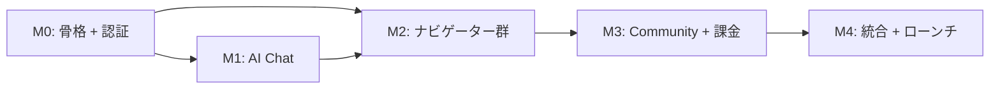

# 開発フェーズ（マイルストーン）

> **必ず順番通りに実装。** スキップ・一括実装は禁止。
> 各マイルストーンの受入基準を全てクリアしてから次へ進む。

---

## M0: プロジェクト骨格 + 認証（先に跑通）

### 範囲
- Flutter プロジェクト初期化（iOS/Android/Web）
- Riverpod + go_router + drift の基盤セットアップ
- Firebase Auth 統合（Email/Password + Apple Sign In）
- バックエンド（FastAPI App Service）のスキャフォールド
- PostgreSQL 初期マイグレーション（profiles, daily_usage テーブル）
- API Gateway（Cloudflare Workers）の基本セットアップ
- 認証フロー（登録 → ログイン → ログアウト）
- メインレイアウト + BottomNavigation + go_router ルーティング
- 多言語基盤（Flutter l10n + ARB ファイル、5 言語スケルトン）

### 含まれるストーリー
- US-001 (ユーザー登録), US-002 (ログイン), US-003 (言語選択), US-005 (ログアウト), US-006 (パスワードリセット)

### 産出物
- `app/` — Flutter プロジェクト（lib/core/, lib/features/auth/, lib/l10n/, pubspec.yaml）
- `backend/app_service/` — FastAPI プロジェクト（main.py, routers/auth.py, models/, migrations/）
- `infra/api-gateway/` — Cloudflare Workers スクリプト
- `infra/migrations/` — Alembic 初期マイグレーション（profiles, daily_usage）
- `infra/firebase/` — Firebase プロジェクト設定

### 検証方法
```bash
# Flutter アプリ起動
cd app && flutter run  # エラーなく起動すること

# バックエンド起動
cd backend/app_service && uvicorn main:app --reload  # エラーなく起動
curl http://localhost:8000/api/v1/health  # {"status": "ok"}

# 認証フロー検証（アプリ上で手動テスト）
# 1. 言語選択画面が表示される
# 2. 登録画面で Email/Password を入力 → Firebase Auth アカウント作成成功
# 3. profiles テーブルにレコードが作成される
# 4. ログアウト → 再ログイン → ホーム画面に遷移
# 5. 未ログインで /home にアクセス → /login にリダイレクト
```

### 受入基準
- [ ] Flutter アプリが iOS/Android/Web で起動する
- [ ] Email/Password で登録・ログイン・ログアウトが動作する
- [ ] 未ログインは認証必須画面にアクセスできない（go_router redirect）
- [ ] profiles テーブルにユーザーデータが保存される
- [ ] 5 言語の切り替えが動作する（UI テキストが切り替わる）
- [ ] API Gateway 経由で App Service にリクエストが到達する

---

## M1: AI Chat Engine（コアバリュー）

### 範囲
- AI Service（FastAPI）のスキャフォールド
- RAG パイプライン（Pinecone + LangChain + Claude API）
- チャットセッション CRUD
- メッセージ送受信（SSE ストリーミング）
- セッションタイトル自動生成
- カテゴリ自動判定
- 日次利用制限（Free ティア: 5 回/日）
- オンボーディング画面

### 含まれるストーリー
- US-004 (オンボーディング), US-101 (セッション作成), US-102 (メッセージ送受信), US-103 (Free 制限), US-104 (履歴一覧), US-105 (セッション削除)

### 産出物
- `backend/ai_service/` — FastAPI プロジェクト（chat_engine/, rag/, routers/chat.py）
- `app/lib/features/chat/` — チャット画面、SSE ストリーミング表示
- `app/lib/features/onboarding/` — オンボーディング画面
- `app/lib/features/home/` — ホーム画面
- Pinecone インデックス初期設定 + ナレッジベース初期投入スクリプト

### 検証方法
```bash
# AI Service 起動
cd backend/ai_service && uvicorn main:app --reload
curl http://localhost:8001/api/v1/health  # {"status": "ok"}

# チャットフロー検証（アプリ上で手動テスト）
# 1. オンボーディング完了 → ホーム画面に遷移
# 2. 新規チャット作成 → チャット画面に遷移
# 3. 「日本で銀行口座を開設するには？」と入力
# 4. AI がストリーミングで回答（文字が流れるように表示）
# 5. ソース引用 URL が表示される
# 6. 免責事項が表示される
# 7. Free ユーザーで 6 回目のメッセージ → 制限メッセージ表示
```

### 受入基準
- [ ] オンボーディング完了 → プロフィール更新 + 5 大手続きが自動追加される
- [ ] チャットセッション作成・一覧・削除が動作する
- [ ] AI チャットがストリーミングで表示される
- [ ] 回答にソース引用 URL が含まれる
- [ ] 免責事項が表示される
- [ ] セッションタイトルが自動生成される
- [ ] Free ティアで 6 回目のメッセージに制限メッセージが表示される
- [ ] 残り回数がチャット画面に表示される

---

## M2: コンテンツナビゲーター群

### 範囲
- Banking Navigator（一覧 + レコメンド + 個別ガイド）
- Visa Navigator（一覧 + 詳細）
- Admin Tracker（チェックリスト + 進捗管理 + 手続き追加）
- Document Scanner（撮影/アップロード → OCR → 翻訳 → 説明）
- Medical Guide（緊急時ガイド + フレーズ集）

### 含まれるストーリー
- US-201〜203 (Banking), US-301〜302 (Visa), US-401〜403 (Admin Tracker), US-501〜502 (Scanner), US-801〜802 (Medical)

### 産出物
- `app/lib/features/banking/` — Banking Navigator 画面群
- `app/lib/features/visa/` — Visa Navigator 画面群
- `app/lib/features/tracker/` — Admin Tracker 画面群
- `app/lib/features/scanner/` — Document Scanner 画面群
- `app/lib/features/medical/` — Medical Guide 画面
- `backend/app_service/routers/` — banking.py, visa.py, procedures.py, medical.py
- `backend/ai_service/routers/` — documents.py
- マスターデータ投入スクリプト（banking_guides, visa_procedures, admin_procedures, medical_phrases）

### 検証方法
```bash
# Banking Navigator
# 1. 銀行一覧が表示される（foreigner_friendly_score 順）
# 2. レコメンド → 条件入力 → スコア順に表示 + 理由表示
# 3. 個別ガイド → 必要書類 + 会話テンプレート表示

# Visa Navigator
# 1. ユーザーの在留資格に応じた手続き一覧が表示される
# 2. 詳細画面で手順 + 書類 + 費用 + 免責事項が表示される

# Admin Tracker
# 1. オンボーディング後に 5 大手続きが表示される
# 2. ステータス変更（not_started → in_progress → completed）が動作
# 3. Free ユーザーで 4 件目の追加 → 制限メッセージ

# Document Scanner
# 1. カメラ/ギャラリーから画像アップロード
# 2. 処理中表示 → OCR テキスト + 翻訳 + 説明が表示
# 3. 書類種別が自動判定される

# Medical Guide
# 1. 緊急時ガイド（119 の呼び方）が表示される
# 2. フレーズ集が日本語 + ふりがな + ユーザー言語で表示される
```

### 受入基準
- [ ] Banking: 銀行一覧・レコメンド（BUSINESS_RULES.md §7 のスコア計算）・個別ガイドが動作
- [ ] Visa: 手続き一覧（在留資格フィルタ）・詳細（免責事項付き）が動作
- [ ] Admin Tracker: CRUD + ステータス遷移 + Free 制限が動作
- [ ] Scanner: 画像アップロード → OCR → 翻訳 → 説明が表示。Free/Premium 月次制限が動作
- [ ] Medical: 緊急時ガイド + フレーズ集（免責事項付き）が表示される
- [ ] 全画面がユーザーの preferred_language で表示される

---

## M3: Community Q&A + 課金

### 範囲
- Community Q&A（投稿一覧 + 詳細 + 作成 + 返信 + 投票 + ベストアンサー）
- AI モデレーション
- Stripe 統合（Checkout + Webhook + サブスク管理）
- サブスクリプション画面（プラン比較 + 購入 + キャンセル）
- Free → Premium アップグレードフロー全体

### 含まれるストーリー
- US-601〜603 (Community), US-701〜703 (Subscription)

### 産出物
- `app/lib/features/community/` — Community Q&A 画面群
- `app/lib/features/subscription/` — サブスクリプション画面
- `backend/app_service/routers/` — community.py, subscriptions.py
- `backend/ai_service/` — moderation.py
- Stripe 設定（商品 + 価格 + Webhook エンドポイント）

### 検証方法
```bash
# Community Q&A
# 1. チャンネル（言語）+ カテゴリ選択 → 投稿一覧表示
# 2. Premium ユーザーで投稿作成 → AI モデレーション通過後に公開
# 3. Free ユーザーで投稿 → 制限メッセージ
# 4. 返信 + 投票（トグル）+ ベストアンサー設定が動作

# サブスクリプション
# 1. プラン比較画面が表示される
# 2. Stripe Checkout → テストカードで支払い → 即座に Premium に
# 3. subscription_tier が 'premium' に更新される
# 4. キャンセル → cancel_at_period_end = true
# 5. Webhook: invoice.payment_failed → status = 'past_due'
```

### 受入基準
- [ ] Community: 投稿 CRUD + 返信 + 投票 + ベストアンサーが動作
- [ ] AI モデレーションが非同期で実行され、approved/flagged が正しく設定される
- [ ] Premium 限定機能（投稿・返信・投票）の制限が動作
- [ ] Stripe Checkout → 支払い → 即座に Premium 機能開放
- [ ] Stripe Webhook が全イベント（BUSINESS_RULES.md §9）を正しく処理
- [ ] キャンセルフローが動作（期間終了まで Premium 維持）

---

## M4: 統合テスト + ローンチ準備

### 範囲
- 全閉ループの E2E テスト
- LP（Astro 静的サイト）構築
- プロフィール・設定画面の仕上げ
- パフォーマンス最適化
- App Store / Google Play 提出準備
- 本番環境デプロイ

### 含まれるストーリー
- US-901〜903 (プロフィール・設定), US-1001 (LP)

### 産出物
- `lp/` — Astro LP サイト（5 言語対応）
- `app/lib/features/profile/` — プロフィール・設定画面
- E2E テストスクリプト（主要閉ループ 6 本）
- App Store / Play Store メタデータ（スクリーンショット、説明文、5 言語）
- 本番環境設定（Fly.io, Cloudflare, Firebase, PostgreSQL, Pinecone, Stripe）

### 検証方法
```bash
# 閉ループ A〜F を手動で通しテスト（see USER_STORIES.md §重要閉ループ）
# A: 初回利用 → AI チャットで問題解決
# B: 銀行口座開設ガイド
# C: 来日直後の手続き管理
# D: 書類スキャン → 内容理解
# E: Community で質問 → 回答取得
# F: Free → Premium アップグレード

# LP
# 1. 5 言語で LP が表示される
# 2. App Store / Play Store リンクが動作する
# 3. Lighthouse スコア: Performance 90+, SEO 95+

# Flutter build
flutter build ios --release  # エラーなし
flutter build appbundle --release  # エラーなし
flutter build web --release  # エラーなし
```

### 受入基準
- [ ] 閉ループ A〜F が全て跑通する（see MVP_ACCEPTANCE.md）
- [ ] LP が 5 言語で表示される（Lighthouse SEO 95+）
- [ ] Flutter アプリが iOS/Android でリリースビルドに成功する
- [ ] 本番環境で全 API が正常応答する
- [ ] 非機能要件を満たす（SYSTEM_DESIGN.md §7）
- [ ] App Store / Play Store 提出準備が完了

---

## マイルストーン間の依存関係



- M0 → M1: 認証基盤が必要
- M0 → M2: 認証 + DB 基盤が必要
- M1 → M2: AI Service 基盤が必要（Scanner が AI Service を使用）
- M2 → M3: コンテンツ機能が揃った後に Community と課金を統合
- M3 → M4: 全機能が揃った後に統合テスト

### 推定期間

| マイルストーン | 推定期間 | 累計 |
|--------------|---------|------|
| M0 | 3-4 日 | 3-4 日 |
| M1 | 4-5 日 | 7-9 日 |
| M2 | 5-7 日 | 12-16 日 |
| M3 | 4-5 日 | 16-21 日 |
| M4 | 3-4 日 | 19-25 日 |

> AI Agent (PM-Worker pipeline) 開発のため、人間開発より大幅に短縮。上記は保守的な見積もり。
