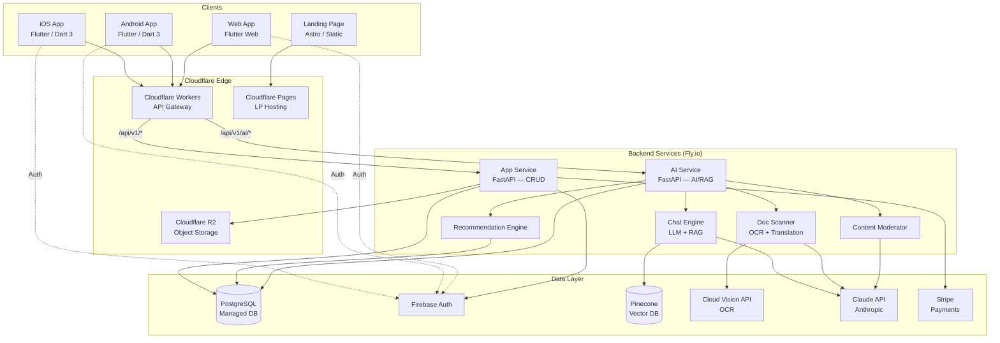
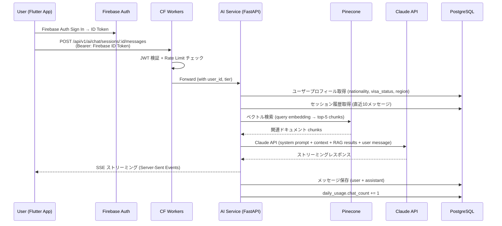
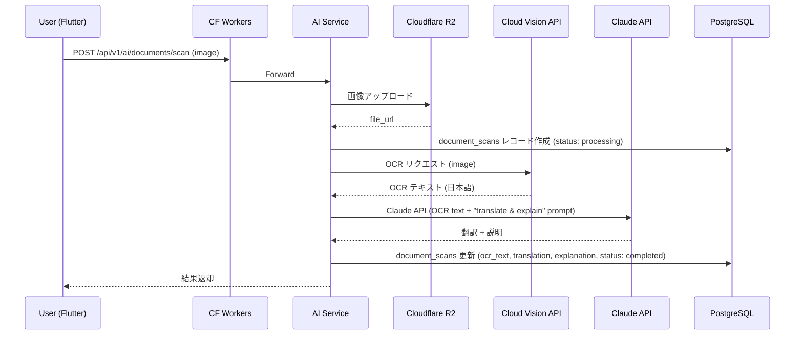
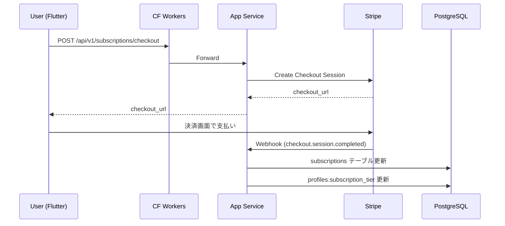
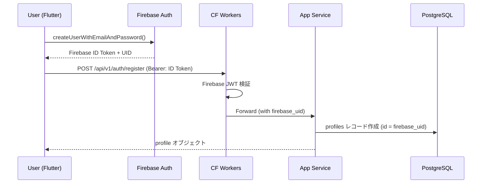

# システム設計

## 1. アーキテクチャ概要

**ハイブリッド（Serverless Edge + Service 分離）アーキテクチャ**

- **Edge Layer**: Cloudflare Workers（API Gateway, Rate Limiting, JWT 検証）
- **App Service**: FastAPI (Python)（CRUD 操作、認証プロキシ、Webhook 処理）— Fly.io 上でコンテナデプロイ
- **AI Service**: FastAPI (Python)（LLM 連携、RAG、OCR）— Fly.io 上でコンテナデプロイ
- **Client**: Flutter (Dart 3)（iOS / Android / Web — 単一コードベース）
- **Data Layer**: PostgreSQL + Firebase Auth + Pinecone (Vector DB) + Cloudflare R2 (Object Storage) + SQLite (クライアントローカル via drift)

**選定理由**:
1. **Flutter 統一**: iOS/Android/Web を単一 Dart コードベースでカバー。AGENTS.md 推奨スタック準拠
2. **Edge-first**: Cloudflare Workers でグローバルに低レイテンシを実現（5 言語 × 多国籍ユーザー）
3. **言語分離**: AI/ML 処理は Python エコシステム（LangChain, FastAPI）が最適。CRUD も FastAPI で統一しオペレーション負荷を最小化
4. **マネージドサービス優先**: Firebase Auth, Pinecone, Fly.io は運用負荷が低く AI Agent 開発と相性が良い
5. **コスト最適**: 月額 ¥55,000 の硬性支出に収まる構成

---

## 2. 技術スタック

| レイヤー | 技術 | バージョン | 選定理由 |
|---------|------|-----------|---------|
| **Mobile/Web** | Flutter | stable 3.x (Dart 3) | AGENTS.md 推奨。iOS/Android/Web を単一コードベースでコンパイル。ネイティブ性能。iOS 優先デザイン対応 |
| **状態管理** | Riverpod | 2.x (+ riverpod_generator) | 型安全、テスタブル、コード生成で boilerplate 削減。AGENTS.md 推奨 |
| **ルーティング** | go_router | 14.x | 宣言的ルーティング、Deep Link 対応、リダイレクトガード。AGENTS.md 推奨 |
| **ローカル DB** | drift (SQLite) | 2.x | 型安全 ORM、マイグレーション管理、オフラインキャッシュ。AGENTS.md 推奨 |
| **HTTP クライアント** | dio | 5.x | インターセプター、リトライ、ストリーミング（SSE）対応 |
| **認証** | Firebase Auth | latest (firebase_auth) | Email/Password + Apple Sign In。AGENTS.md 推奨。無料枠大きい（50K MAU） |
| **i18n** | Flutter intl (ARB) | built-in | Flutter 公式の多言語対応。5 言語 ARB ファイルで管理 |
| **UI** | Material 3 + Cupertino | Flutter built-in | iOS 優先デザイン（CupertinoNavigationBar 等）。Android は Material 3 |
| **API Gateway** | Cloudflare Workers | Wrangler 3.x | グローバルエッジ、低レイテンシ。無料枠が大きい |
| **App Service** | FastAPI (Python) | 0.115+ | CRUD 操作、Webhook 処理。AI Service と言語統一でコード共有 |
| **AI Service** | FastAPI (Python) | 0.115+ | 非同期 I/O、ストリーミングレスポンス、AI/ML ライブラリとの親和性 |
| **Python** | Python | 3.12+ | LangChain / Anthropic SDK / FastAPI の要件 |
| **LLM** | Claude API (Anthropic) | claude-sonnet-4-20250514 | 多言語品質が高い。日本語に強い。コスト効率が良い |
| **RAG Framework** | LangChain | 0.3.x | Pinecone 連携、ドキュメントローダー、チェーン構築が容易 |
| **Vector DB** | Pinecone | Serverless | マネージド、スケーラブル、Starter プランで MVP 十分 |
| **Embedding** | text-embedding-3-small (OpenAI) | latest | Pinecone との実績、コスト効率 |
| **OCR** | Google Cloud Vision API | v1 | 日本語 OCR 精度が最高水準 |
| **Server DB** | PostgreSQL | 15+ | 業界標準 RDBMS。マネージド PostgreSQL（Supabase DB / Neon 等）で運用 |
| **Auth** | Firebase Auth | latest | Email/Password + Apple Sign In。JWT 発行。無料枠 50K MAU |
| **Object Storage** | Cloudflare R2 | latest | S3 互換、エグレス無料 |
| **決済** | Stripe | latest SDK | 多通貨対応、サブスク管理、Webhook |
| **LP (ランディングページ)** | Astro (静的サイト) | 5.x | SEO 最適化。Cloudflare Pages にデプロイ。Flutter Web は SPA のため LP には不向き |

### 技術選定の判断根拠

AGENTS.md の推奨スタック「クロスプラットフォーム App → Flutter stable + Dart 3」に準拠。
Strategist の product-spec §4.2 では React Native (Expo) が記載されていたが、**技術スタック選定は Architect の職責**であり、以下の理由で Flutter を採用:

1. **AGENTS.md 硬性ルール準拠**: クロスプラットフォーム App は Flutter + Dart 3 が推奨
2. **ネイティブ性能**: Flutter は独自レンダリングエンジンにより iOS/Android で一貫したパフォーマンス
3. **iOS 優先デザイン**: Cupertino ウィジェットで iOS ネイティブの UX を提供
4. **ローカル DB**: drift (SQLite) による型安全なローカルキャッシュで将来のオフライン対応に備える
5. **Firebase Auth**: Apple Sign In 必須要件に対応。Supabase Auth 比でモバイル SDK の成熟度が高い

---

## 3. システムコンポーネント図



---

## 4. データフロー

### 4.1 AI チャットフロー（コアフロー）



### 4.2 Document Scanner フロー



### 4.3 サブスクリプションフロー



### 4.4 認証フロー



---

## 5. 外部依存

| サービス | 用途 | 料金モデル | MVP 月額想定 | フォールバック |
|---------|------|-----------|-------------|-------------|
| **Claude API** (Anthropic) | LLM (チャット、翻訳、要約、モデレーション) | 従量課金 ($3/1M input, $15/1M output — Sonnet) | ¥30,000 | GPT-4o-mini に切替可（LangChain 経由で抽象化） |
| **OpenAI Embedding** | テキスト埋め込み (RAG) | 従量課金 ($0.02/1M tokens) | ¥1,000 | Cohere Embed に切替可 |
| **Google Cloud Vision** | OCR（日本語文書） | 従量課金 ($1.50/1,000 images) | ¥10,000 | Tesseract (OSS) に切替（精度低下あり） |
| **Firebase Auth** | 認証 (Email + Apple Sign In) | 50K MAU 無料 → $0.0055/MAU 超過分 | ¥0 (MVP) | 自前 JWT 発行（移行コスト大） |
| **PostgreSQL** (マネージド) | リレーショナル DB | プラン依存 ($25/mo Supabase Pro 等) | ¥5,000 | セルフホスト PostgreSQL |
| **Pinecone** | ベクトル検索 (RAG) | Starter Free → Standard $70/mo | ¥3,000 | pgvector (PostgreSQL 拡張) に切替可 |
| **Cloudflare Workers/R2/Pages** | API Gateway + Object Storage + LP | 従量 + $5/mo (R2) | ¥3,000 | AWS API Gateway + S3（コスト増） |
| **Stripe** | 決済・サブスク管理 | 3.6% + ¥40/件 | ¥0 (売上連動) | なし（決済は Stripe 一択） |
| **Fly.io** | App Service + AI Service ホスティング | shared-cpu-1x $5/mo~ × 2 | ¥4,000 | Railway / Render |

**月額合計（MVP）**: 約 ¥56,000

---

## 6. デプロイアーキテクチャ

### ホスティング

| コンポーネント | ホスト | 理由 |
|--------------|--------|------|
| Flutter (iOS) | App Store | Flutter build → Xcode Archive → App Store Connect |
| Flutter (Android) | Google Play | Flutter build → AAB → Play Console |
| Flutter (Web) | Cloudflare Pages | Flutter build web → 静的ファイルデプロイ |
| App Service (FastAPI) | Fly.io (nrt) | Docker デプロイ、東京リージョン |
| AI Service (FastAPI) | Fly.io (nrt) | Docker デプロイ、東京リージョン |
| API Gateway | Cloudflare Workers | グローバルエッジ |
| LP (Astro) | Cloudflare Pages | 静的サイト、エッジ配信 |
| DB | マネージド PostgreSQL (ap-northeast-1) | 東京リージョン |
| Vector DB | Pinecone (AWS ap-northeast-1) | 東京リージョン |
| Object Storage | Cloudflare R2 | APAC PoP |

### CI/CD

```
GitHub Repository (monorepo)
├── app/                       → Flutter App (iOS/Android/Web)
│   ├── lib/
│   │   ├── core/              → DI, theme, constants
│   │   ├── features/          → feature-first 構造
│   │   ├── l10n/              → ARB 多言語ファイル (5言語)
│   │   └── main.dart
│   ├── test/
│   └── pubspec.yaml
├── backend/
│   ├── app_service/           → FastAPI (CRUD, Webhook)
│   ├── ai_service/            → FastAPI (AI, RAG, OCR)
│   └── shared/                → 共有ユーティリティ
├── infra/
│   ├── api-gateway/           → Cloudflare Workers
│   ├── migrations/            → PostgreSQL マイグレーション (Alembic)
│   └── firebase/              → Firebase 設定ファイル
├── lp/                        → Astro 静的サイト (LP)
└── docs/                      → アーキテクチャ文書
```

**CI/CD パイプライン**:
- `main` push → Fly.io (App Service + AI Service) 自動デプロイ（Dockerfile ベース）
- `main` push → Wrangler (CF Workers) 自動デプロイ
- `main` push → Alembic マイグレーション適用
- `main` push → Cloudflare Pages (LP + Flutter Web) 自動デプロイ
- Release tag → Flutter build ios/android → App Store / Google Play 提出

### 環境

| 環境 | 用途 | URL |
|------|------|-----|
| `development` | ローカル開発 | `localhost` (Flutter DevTools), `localhost:8000` (API) |
| `staging` | PR テスト | Fly.io preview app + Flutter Web preview |
| `production` | 本番 | `gaijin-life-navi.com` (仮) |

### ドメイン / DNS

- ドメイン: `gaijin-life-navi.com`（仮。ローンチ前に確定）
- DNS: Cloudflare DNS（Workers との統合が容易）
- SSL: Cloudflare 自動 SSL

---

## 7. 非機能要件

| 項目 | 目標値 | 計測方法 |
|------|--------|---------|
| **API レスポンス時間** (CRUD) | p95 < 300ms | FastAPI ログ + Fly.io メトリクス |
| **AI チャット初回トークン** | < 2 秒 | AI Service ログ + クライアント計測 |
| **AI チャットストリーミング** | トークン間隔 < 100ms | クライアント計測 |
| **アプリ起動時間** (Cold Start) | < 3 秒 | Flutter DevTools / Firebase Performance |
| **可用性** | 99.5% (MVP) | Uptime Robot (無料枠) |
| **同時接続** | 1,000 (MVP 初期) | 負荷テスト |
| **データ暗号化** | 通信: TLS 1.3、保存: DB 標準暗号化 | 設定確認 |
| **認証** | Firebase Auth (bcrypt 相当)、ID Token 有効期限 1 時間 | 設定確認 |
| **認可** | アプリケーション層で user_id チェック（全 API） | コードレビュー + テスト |
| **個人情報** | PII は DB のみに保存。ログに PII を出力しない | コードレビュー |
| **GDPR/個人情報保護法** | アカウント削除機能、データエクスポート | 機能テスト |
| **Rate Limiting** | Free: 5 chat/日、全ユーザー: 60 req/min | CF Workers |
