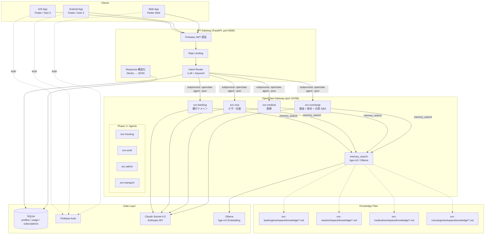
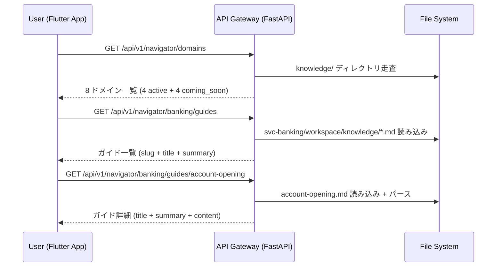

# システム設計

## 1. アーキテクチャ概要

**OpenClaw Runtime アーキテクチャ**

- **API Gateway**: FastAPI (Python, port 8000)（Firebase JWT 認証、Rate Limiting、Agent ルーティング、レスポンス構造化）
- **Agent Runtime**: OpenClaw Gateway (port 18789)（Session 管理、LLM 呼び出し、Tool 制御、memory_search）
- **Service Agents**: svc-concierge / svc-banking / svc-visa / svc-medical（各自 workspace + knowledge files）
- **Client**: Flutter (Dart 3)（iOS / Android / Web — 単一コードベース）
- **Data Layer**: SQLite (aiosqlite) + Firebase Auth + memory_search (bge-m3, Ollama)

**選定理由**:
1. **OpenClaw as Runtime**: Session 管理・LLM 呼び出し・Tool 制御・knowledge 検索が全て組み込み済み。独自 AI Service 不要
2. **Flutter 統一**: iOS/Android/Web を単一 Dart コードベースでカバー。AGENTS.md 推奨スタック準拠
3. **memory_search**: 各 agent の workspace/knowledge/ に .md ファイル配置 → bge-m3 (Ollama) で意味検索。pgvector/Pinecone 不要
4. **SQLite (Phase 0)**: 軽量運用。profiles, usage, subscriptions のみ。将来 PostgreSQL 移行可
5. **コスト最適**: 独自 AI Service・Vector DB・Edge Workers を排除し、OpenClaw 1 プロセスに集約

---

## 2. 技術スタック

| レイヤー | 技術 | バージョン | 選定理由 |
|---------|------|-----------|---------|
| **Mobile/Web** | Flutter | stable 3.x (Dart 3) | AGENTS.md 推奨。iOS/Android/Web を単一コードベースでコンパイル。iOS 優先デザイン対応 |
| **状態管理** | Riverpod | 2.x (+ riverpod_generator) | 型安全、テスタブル、コード生成で boilerplate 削減 |
| **ルーティング** | go_router | 14.x | 宣言的ルーティング、Deep Link 対応、リダイレクトガード |
| **ローカル DB** | drift (SQLite) | 2.x | 型安全 ORM、オフラインキャッシュ |
| **HTTP クライアント** | dio | 5.x | インターセプター、リトライ |
| **認証** | Firebase Auth | latest (firebase_auth) | Email/Password + Apple Sign In。無料枠 50K MAU |
| **i18n** | Flutter intl (ARB) | built-in | Flutter 公式の多言語対応。5 言語 ARB ファイルで管理 |
| **UI** | Material 3 + Cupertino | Flutter built-in | iOS 優先デザイン |
| **API Gateway** | FastAPI (Python 3.12+) | 0.115+ | async 対応、OpenClaw CLI subprocess 呼び出しに最適 |
| **Agent Runtime** | OpenClaw Gateway | latest | Session 管理、LLM 呼び出し、Tool 制御、memory_search |
| **LLM** | Claude Sonnet 4.5 (Anthropic) | claude-sonnet-4-5 | 全 svc-* agent のデフォルト。コスト効率。複雑な判断時のみ Opus に昇格 |
| **Knowledge / RAG** | memory_search (bge-m3, Ollama) | latest | workspace/knowledge/*.md を意味検索。多言語対応（日中英） |
| **Server DB** | SQLite (aiosqlite) | latest | Phase 0 軽量運用。将来 PostgreSQL 移行可 |
| **Auth** | Firebase Auth | latest | Email/Password + Apple Sign In。JWT 発行 |
| **決済** | Apple IAP + Google Play Billing | latest SDK | ネイティブ決済 |
| **Hosting** | VPS (東京リージョン) | — | OpenClaw + API Gateway 同居 |

### ~~旧技術スタック（Phase 0 ピボットで廃止）~~

以下は Phase 0 ピボットで廃止された技術:
- ~~Cloudflare Workers (API Gateway)~~ → FastAPI に統合
- ~~AI Service (FastAPI, port 8001)~~ → OpenClaw Runtime に統合
- ~~Pinecone (Vector DB)~~ → memory_search (bge-m3) に代替
- ~~LangChain (RAG Framework)~~ → OpenClaw memory_search に代替
- ~~OpenAI Embedding (text-embedding-3-small)~~ → bge-m3 (Ollama) に代替
- ~~Google Cloud Vision API (OCR)~~ → AI Chat 画像入力に統合
- ~~PostgreSQL (マネージド)~~ → SQLite (Phase 0)
- ~~Cloudflare R2 (Object Storage)~~ → Phase 0 では不要
- ~~Stripe~~ → Apple IAP + Google Play Billing
- ~~Astro (LP)~~ → Phase 0 スコープ外

---

## 3. システムコンポーネント図



---

## 4. Agent トポロジー

### 4.1 開発用 Agent と Service Agent の完全分離

| 種別 | Agent 例 | 呼び出し元 | 特徴 |
|------|---------|-----------|------|
| 開発用 | main, pm, strategist, architect, coder, designer, tester, writer | Telegram/WhatsApp | 個人データ・プロジェクト情報にアクセス |
| Service用 | svc-concierge, svc-banking, svc-visa, svc-medical | API Gateway (subprocess) | ユーザーデータは最小限。knowledge/ のみ参照 |

### 4.2 MVP Agent 一覧（4体）

| Agent ID | 役割 | 知識ドメイン | 知識ファイル数 |
|----------|------|------------|-------------|
| svc-concierge | 意図分類 + domain routing + 汎用 Q&A | 全ドメイン横断 | ~5 files |
| svc-banking | 口座開設 wizard、送金比較、税金支払い | 金融庁、全銀協、各行公式 | ~6 files |
| svc-visa | 更新/変更/永住フロー、期限計算 | 入管庁、ISA ポータル | ~6 files |
| svc-medical | 症状→診療科、保険説明、緊急対応 | 厚労省、多言語医療ガイド | ~7 files |

### 4.3 Phase 1+ 追加 Agent（4体）

| Agent ID | 役割 |
|----------|------|
| svc-housing | 物件探し、契約用語、退去トラブル |
| svc-work | 労働法、社保、確定申告、転職 |
| svc-admin | 転入届、マイナンバー、年金、国保 |
| svc-transport | IC カード、定期券、免許切替 |

### 4.4 Agent 共通設定

```jsonc
{
  "id": "svc-banking",
  "model": "anthropic/claude-sonnet-4-5",
  "tools": {
    "allow": ["web_search", "web_fetch", "read", "memory_search", "memory_get"]
  }
}
```

### 4.5 Agent Workspace 構造

```
~/.openclaw/agents/svc-banking/workspace/
  ├── AGENTS.md          # Agent の役割・行動規範
  ├── IDENTITY.md        # Agent のアイデンティティ
  ├── TOOLS.md           # 利用可能ツールのメモ
  ├── SOUL.md            # Agent の個性定義
  └── knowledge/         # 知識ファイル（memory_search + read 対象）
      ├── banks-overview.md
      ├── account-opening.md
      ├── remittance.md
      ├── tax-payment.md
      ├── online-banking.md
      └── faq.md
```

---

## 5. 通信フロー

### 5.1 Agent 呼び出し方式

API Gateway から OpenClaw agent を subprocess で呼び出す:

```bash
openclaw agent \
  --agent svc-banking \
  --session-id "app_{user_id}_banking" \
  --message "{user_message}" \
  --json --thinking low \
  --timeout 60
```

**特性**:
- 同期呼び出し（Phase 0 では SSE ストリーミングなし）
- Session 持続性: OpenClaw が session_id でコンテキストを保持（prompt cache 有効）
- タイムアウト: CLI 60 秒 + subprocess 75 秒（15 秒バッファ）

### 5.2 AI チャットフロー（コアフロー）


### 5.3 Navigator フロー



### 5.4 認証フロー


### 5.5 サブスクリプションフロー


---

## 6. 知識管理設計（memory_search ベース）

### 6.1 方針

OpenClaw memory_search をそのまま RAG として使用。

**決定理由**:
1. 各 svc-* agent の workspace は完全分離 → 開発用 agent の個人データは見えない
2. 知識量が小さい（各 agent ~30KB, ~15-20 files）→ memory_search で十分
3. pgvector/Pinecone 不要 → インフラ・運用コスト削減
4. bge-m3 多言語モデルが Ollama で既に稼働中 → 中日英対応済み
5. ファイル編集 = 知識更新 → パイプライン不要

### 6.2 知識ファイル配置

各 agent の `workspace/knowledge/` ディレクトリに .md ファイルとして配置。
`memorySearch.extraPaths: ["knowledge"]` が defaults で設定済みのため、自動的に検索対象になる。

### 6.3 現在の知識ファイル一覧

| Agent | ファイル | 内容 |
|-------|---------|------|
| svc-banking | banks-overview.md | 主要銀行比較表 |
| | account-opening.md | 口座開設手順・必要書類 |
| | remittance.md | 海外送金方法比較 |
| | tax-payment.md | 税金支払い方法 |
| | online-banking.md | ネットバンキング・ATM |
| | faq.md | よくある質問 |
| svc-visa | residence-status-overview.md | 在留資格概要 |
| | visa-renewal.md | ビザ更新手順 |
| | permanent-residency.md | 永住権申請 |
| | immigration-offices.md | 入管局一覧 |
| | deadline-rules.md | 期限ルール |
| | faq.md | よくある質問 |
| svc-medical | emergency.md | 緊急連絡先・救急ガイド |
| | health-insurance.md | 健康保険制度 |
| | hospital-guide.md | 病院受診ガイド |
| | medical-terms.md | 医療用語集 |
| | mental-health.md | メンタルヘルス |
| | pharmacy-guide.md | 薬局ガイド |
| | vaccination.md | 予防接種 |
| svc-concierge | domains-overview.md | ドメイン概要 |
| | life-basics.md | 生活基本情報 |
| | cultural-tips.md | 文化 Tips |
| | routing-rules.md | ルーティングルール |
| | useful-contacts.md | 便利な連絡先 |

### 6.4 知識源と更新頻度

| ドメイン | 主要ソース | 更新頻度 |
|---------|-----------|---------|
| Banking | 金融庁、全銀協、主要銀行公式サイト | 半年 |
| Visa | 入管庁、ISA ポータル | 法改正時 |
| Medical | 厚労省、AMDA 多文化共生ガイド | 四半期 |
| General | ISA 外国人生活支援ポータル（17言語） | 月次 |

### 6.5 Agent からの知識利用方式

1. `memory_search`: ユーザーの質問から関連知識を意味検索 → 上位 snippets を参考に回答
2. `memory_get`: 検索ヒット後、必要な行だけを取得（コンテキスト節約）
3. `read`: 構造化データ（比較表、フロー定義等）を直接読み込み
4. `web_search` / `web_fetch`: 知識ファイルにない最新情報を補完

### 6.6 将来の拡張

精確なデータ検索（例: 特定の在留資格番号、税率テーブル）が必要になった場合は
データベース（PostgreSQL 等）を追加する。memory_search（意味検索）+ DB（正確検索）の二層構成。

---

## 7. 外部依存

| サービス | 用途 | 料金モデル | MVP 月額想定 | フォールバック |
|---------|------|-----------|-------------|-------------|
| **Claude Sonnet 4.5** (Anthropic) | 全 svc-* agent の LLM | 従量課金 | ¥30,000 | Haiku に切替（品質低下） |
| **Ollama (bge-m3)** | テキスト埋め込み (memory_search) | セルフホスト（無料） | ¥0 | — |
| **Firebase Auth** | 認証 (Email + Apple Sign In) | 50K MAU 無料 | ¥0 (MVP) | 自前 JWT |
| **Apple IAP** | iOS 決済 | 30% 手数料 | 売上連動 | — |
| **Google Play Billing** | Android 決済 | 30% 手数料 | 売上連動 | — |
| **VPS** | OpenClaw + API Gateway 同居 | 月額固定 | ¥5,000-10,000 | — |

**月額合計（MVP）**: 約 ¥35,000-40,000（旧アーキテクチャの ¥56,000 から大幅削減）

---

## 8. デプロイアーキテクチャ

### ホスティング

| コンポーネント | ホスト | 理由 |
|--------------|--------|------|
| Flutter (iOS) | App Store | Flutter build → Xcode Archive → App Store Connect |
| Flutter (Android) | Google Play | Flutter build → AAB → Play Console |
| Flutter (Web) | VPS (nginx) or Cloudflare Pages | 静的ファイルデプロイ |
| API Gateway (FastAPI) | VPS (東京リージョン) | Docker or systemd、OpenClaw と同居 |
| OpenClaw Gateway | VPS (東京リージョン) | 常時稼働デーモン |
| Ollama (bge-m3) | VPS (同上) | memory_search 用 embedding サーバー |
| DB | VPS (同上) | SQLite ファイル |

### CI/CD

```
GitHub Repository (monorepo)
├── app/                       → Flutter App (iOS/Android/Web)
│   ├── lib/
│   │   ├── core/              → DI, theme, constants
│   │   ├── features/          → feature-first 構造
│   │   ├── l10n/              → ARB 多言語ファイル (5言語)
│   │   └── main.dart
│   ├── test/
│   └── pubspec.yaml
├── backend/
│   └── app_service/           → FastAPI (API Gateway)
│       ├── main.py
│       ├── routers/           → chat, navigator, auth, etc.
│       ├── services/          → agent, usage, auth
│       ├── models/            → SQLAlchemy models
│       └── config.py
└── docs/                      → 設計文書
```

**CI/CD パイプライン**:
- `main` push → VPS (API Gateway) 自動デプロイ
- `main` push → SQLite マイグレーション適用
- Release tag → Flutter build ios/android → App Store / Google Play 提出

### 環境

| 環境 | 用途 | URL |
|------|------|-----|
| `development` | ローカル開発 | `localhost:8000` (API Gateway) |
| `production` | 本番 | VPS IP / ドメイン |

---

## 9. 非機能要件

| 項目 | 目標値 | 計測方法 |
|------|--------|---------|
| **API レスポンス時間** (CRUD) | p95 < 300ms | FastAPI ログ |
| **AI Chat レスポンス（routing 含む）** | < 8 秒 (routing ~4s + agent ~4s) | API Gateway ログ |
| **AI Chat レスポンス（routing skip）** | < 5 秒 | domain hint 指定時 |
| **アプリ起動時間** (Cold Start) | < 3 秒 | Flutter DevTools |
| **可用性** | 99.5% (MVP) | Uptime Robot (無料枠) |
| **同時接続** | 100 (MVP 初期) | 負荷テスト |
| **データ暗号化** | 通信: TLS 1.3 | 設定確認 |
| **認証** | Firebase Auth、ID Token 有効期限 1 時間 | 設定確認 |
| **認可** | アプリケーション層で user_id チェック（全 API） | コードレビュー + テスト |
| **個人情報** | PII は SQLite のみに保存。ログに PII を出力しない | コードレビュー |
| **Agent 分離** | svc-* agent 間の knowledge/session は相互不可視 | OpenClaw workspace 分離 |

### 9.1 product-spec §7 NFR への対応設計

> strategy/product-spec.md §7 の Non-functional Requirements に対するシステム設計回答。

| NFR（product-spec §7） | 要件 | 対応方針 | 実装方法 |
|------------------------|------|---------|---------|
| **7.1 パフォーマンス** — AI Chat 初回トークン 3秒以内 | テスト実績 3.4 秒 | LLM 直接呼出し + prompt cache | OpenClaw subprocess → Claude Sonnet 4.5。prompt cache で system prompt 部分 90% 再利用 |
| **7.1 パフォーマンス** — Navigator 2秒以内 | ファイル直読み | knowledge/*.md を API Gateway が直接読込 | FastAPI ファイルシステムアクセス。将来は Cloudflare CDN Edge Cache 追加可 |
| **7.1 パフォーマンス** — 3ユーザー並行 13秒以内 | テスト実績 12.8 秒 | async subprocess 並行処理 | FastAPI async + `asyncio.create_subprocess_exec` で並行呼出し |
| **7.2 対応デバイス** — iOS / Android / Web | クロスプラットフォーム必須 | Flutter single codebase | Flutter stable 3.x + Dart 3。iOS 優先デザイン (Material 3 + Cupertino) |
| **7.3 オフライン** — Emergency: Must | 緊急情報はローカルに保持 | drift ローカル DB にキャッシュ | 初回起動時に `/api/v1/emergency` データを drift に保存。以降はオフラインでもアクセス可能 |
| **7.3 オフライン** — Navigator: Should | 閲覧済みガイドをキャッシュ | drift にガイドコンテンツをキャッシュ | Phase 1 で完全実装。Phase 0 は閲覧済みのみキャッシュ |
| **7.3 オフライン** — Chat: オンライン必須 | LLM 呼出しのため不可 | オフライン時はエラーメッセージ表示 | Flutter の connectivity チェック → 「インターネット接続が必要です」メッセージ |
| **7.4 アクセシビリティ** — VoiceOver / TalkBack | 画面読み上げ対応 | Flutter Semantics API | 全 UI 要素に `Semantics` widget でラベル付与。画像には `semanticLabel` 設定 |
| **7.4 アクセシビリティ** — 文字サイズ変更 | 端末設定に追従 | `MediaQuery.textScaleFactor` | Flutter のデフォルト動作で対応。レイアウト崩れテストを各解像度で実施 |
| **7.4 アクセシビリティ** — 高コントラスト | Phase 1 (Should) | `MediaQuery.highContrast` で切替 | Phase 0 は標準テーマのみ。Phase 1 で高コントラスト対応テーマを追加 |
| **7.5 多言語** — MVP 5言語 UI | en/zh/vi/ko/pt | Flutter l10n (ARB) | 5 言語の ARB ファイルで UI テキスト管理。端末ロケールで自動選択、未対応は `en` フォールバック |
| **7.5 多言語** — AI Chat 14言語以上 | LLM 動的翻訳 | Claude の多言語能力 + locale ヒント | `[User language: {locale}]` プレフィックスでヒント送信。Claude が入力言語を自動検出し同言語で応答 |

---

## 10. セキュリティ設計

### Service Agent Tool 制限

- ✅ 許可: `web_search`, `web_fetch`, `read`, `memory_search`, `memory_get`
- ❌ 禁止: 上記以外の全ツール（`exec`, `write`, `edit`, `browser`, `message` 等）

### データ隔離

- Service Agent は OpenClaw 開発用 workspace にアクセス不可
- 各 svc-* agent の memory_search は自 workspace のみ検索
- User データは API Gateway の SQLite に保持（OpenClaw session にはユーザー PII を最小限に）

### Session Key 設計

- 形式: `app_{user_id}_{domain}`（コロン不可 → アンダースコア使用）
- 例: `app_firebase_uid_abc123_banking`
- 開発用 session (`agent:main:*`, `agent:pm:*`) とは名前空間が完全に分離
- `build_session_id()` 関数でコロン等の禁止文字を自動サニタイズ

---

## 11. Observability & Analytics 設計

> strategy/business-plan.md §7 の KPI を測定可能にするためのシステム設計。

### 11.1 Analytics SDK 構成

| コンポーネント | ツール | 用途 |
|--------------|--------|------|
| アプリ Analytics | Firebase Analytics (Flutter `firebase_analytics`) | ユーザー行動追跡、KPI 測定 |
| Crash Reporting | Firebase Crashlytics (Flutter `firebase_crashlytics`) | アプリクラッシュの自動レポート |
| API ログ | FastAPI 構造化ログ (JSON) | API レイテンシ、エラー率、Agent 呼出し時間 |
| LLM コスト追跡 | `AgentResponse` の `input_tokens` / `output_tokens` 集計 | API コスト最適化、ティア別コスト分析 |

### 11.2 KPI → Analytics イベントマッピング

| KPI（business-plan §7） | 定義 | Analytics イベント名 | 埋点箇所 | パラメータ |
|-------------------------|------|---------------------|---------|-----------|
| DAU | 日間アクティブユーザー | `app_open` (Firebase 自動収集) | App 起動時 | — |
| MAU | 月間アクティブユーザー | `app_open` (Firebase 自動収集) | App 起動時 | — |
| Chat 利用率 | AI Chat を使った DAU の割合 | `chat_message_sent` | `POST /api/v1/chat` 成功レスポンス受信時 | `domain`, `tier`, `locale` |
| 課金転換率 | Free → Standard/Premium | `subscription_started` | `POST /api/v1/subscription/purchase` 成功時 | `tier`, `platform`, `price` |
| ARPU | 課金者あたり月間売上 | `subscription_started` + `charge_pack_purchased` | 各購入完了時 | `amount`, `tier` |
| Churn Rate | 月間解約率 | `subscription_cancelled` | IAP Server Notification 受信時 | `tier`, `duration_months` |
| AI 回答品質 | サムズアップ/ダウン | `chat_feedback` | Chat 回答後のフィードバックボタン押下時 | `domain`, `rating` (`good`/`bad`), `session_id` |
| Tracker 完了率 | TODO 完了割合 | `tracker_item_completed` | Tracker アイテム完了チェック時 | `domain`, `auto_generated` (bool) |
| Navigator 閲覧 | ガイド閲覧数 | `guide_viewed` | `GET /navigator/{domain}/guides/{slug}` 成功時 | `domain`, `slug` |
| 登録完了 | 新規登録数 | `sign_up` (Firebase 自動収集) | Firebase Auth 登録完了時 | `method` (`email`/`apple`) |
| OB 完了率 | オンボーディング完了率 | `onboarding_completed` | `POST /api/v1/users/me/onboarding` 成功時 | `nationality`, `residence_status` |
| Emergency アクセス | 緊急ガイド利用数 | `emergency_accessed` | `GET /api/v1/emergency` 成功時 | `authenticated` (bool) |
| 制限到達 | 制限到達回数 | `usage_limit_reached` | `POST /api/v1/chat` で 429 返却時 | `tier`, `used`, `limit` |
| CTA 表示/タップ | アップグレード CTA 効果 | `upgrade_cta_shown` / `upgrade_cta_tapped` | 制限メッセージ表示時 / CTA ボタン押下時 | `tier`, `source` (`chat`/`navigator`) |

### 11.3 カスタムイベント定義（Flutter 側）

```dart
// analytics_events.dart — 全カスタムイベント名を一元管理
class AnalyticsEvents {
  static const chatMessageSent = 'chat_message_sent';
  static const chatFeedback = 'chat_feedback';
  static const guideViewed = 'guide_viewed';
  static const subscriptionStarted = 'subscription_started';
  static const chargePackPurchased = 'charge_pack_purchased';
  static const subscriptionCancelled = 'subscription_cancelled';
  static const trackerItemCompleted = 'tracker_item_completed';
  static const onboardingCompleted = 'onboarding_completed';
  static const emergencyAccessed = 'emergency_accessed';
  static const usageLimitReached = 'usage_limit_reached';
  static const upgradeCTAShown = 'upgrade_cta_shown';
  static const upgradeCTATapped = 'upgrade_cta_tapped';
}
```

### 11.4 ダッシュボード構成

| ダッシュボード | ツール | 主要指標 | 更新頻度 |
|--------------|--------|---------|---------|
| Growth | Firebase Console | DAU, MAU, 新規登録数, DL 数 | リアルタイム |
| Engagement | Firebase Console | Chat 利用率, Navigator 閲覧, Session 時間 | リアルタイム |
| Revenue | Firebase Console + API ログ集計 | 課金転換率, ARPU, MRR, Churn | 日次集計 |
| AI Quality | API ログ集計 | 回答品質スコア (`chat_feedback`), ルーティング精度, レスポンスタイム, トークン消費量 | 日次集計 |
| Stability | Firebase Crashlytics | クラッシュ率, ANR 率, API エラー率 | リアルタイム |

### 11.5 Post-Launch Operations

| 項目 | ツール | 設定 |
|------|--------|------|
| Crash Reporting | Firebase Crashlytics | iOS: dSYM 自動アップロード。Android: mapping file アップロード |
| User Feedback | アプリ内サムズアップ/ダウン + 設定画面「フィードバック送信」 | `chat_feedback` イベントで集約。低評価回答のパターン分析 |
| App Store レビュー監視 | App Store Connect / Play Console | 週次レビュー。低評価（1-2 星）には 48 時間以内に返信 |
| SNS モニタリング | 手動（Reddit r/japanlife, Twitter/X） | 週次チェック。プロダクト名の言及を確認 |
| A/B Testing | Firebase Remote Config | Phase 1 以降（MVP では不要）。Phase 0 は Remote Config の SDK 統合のみ |
| 知識ファイル鮮度管理 | 手動 + 更新カレンダー | 四半期ごとにソース確認・更新（product-spec §3.1 の更新頻度に準拠） |

---

## 12. LP ↔ App 統合設計

> strategy/gtm-plan.md §6 の Acquisition Funnel に対応。
> LP と App は同一ユーザー旅程の異なるタッチポイントとして設計する。

### 12.1 Acquisition Funnel の技術実現

```
SEO 記事 / Google 広告 / Reddit / Facebook
    ↓ Web ブラウザ
LP（Phase 1）/ Flutter Web（Phase 0 暫定）
    ↓ Navigator コンテンツ閲覧（ゲストアクセス可）
    ↓ 「AI に聞いてみる」CTA
App Store / Google Play（Smart Banner 経由）
    ↓ ダウンロード
Flutter App（ゲスト導線で Navigator + Emergency を体験）
    ↓ 登録 CTA
Firebase Auth 登録 → AI Chat 5回/日
    ↓ 回数制限到達
Standard ¥720/月 or 従量 ¥360/100回
```

### 12.2 Phase 0: Flutter Web as 暫定 LP

Phase 0 では専用 LP を構築しない（DECISIONS.md §C10）。代替として:

| 要素 | Phase 0 実現方法 |
|------|-----------------|
| SEO 流入受け皿 | Flutter Web 版の Navigator ページが検索エンジンにインデックスされる |
| AI Chat 体験 | Flutter Web 版で登録後に AI Chat を利用可能 |
| App Store 導線 | Flutter Web 版のバナーで「アプリで快適に使う」→ App Store / Play Store リンク |
| ディープリンク | Phase 0 では未実装。ストアリンクのみ |

### 12.3 Phase 1: 専用 LP 構築

| 要素 | 技術 | 目的 |
|------|------|------|
| LP フレームワーク | Next.js + SSR (Cloudflare Pages) | SEO 最適化（Flutter Web は CSR のため SEO に限界あり） |
| Navigator コンテンツ同期 | LP から API Gateway 経由で knowledge/*.md を取得 | Navigator ガイドの Web 版を SEO 記事として公開 |
| AI Chat デモ | LP 内に制限付き Chat ウィジェット（1回お試し） | 登録前に AI Chat の価値を体験 |
| App Store Smart Banner | iOS Smart App Banner + カスタムバナー | Web → App へのシームレスな誘導 |
| ディープリンク | Firebase Dynamic Links or Universal Links | LP → App 特定画面への遷移（例: Banking 記事 → App の Banking Navigator） |
| UTM トラッキング | LP の UTM パラメータ → App 初回起動時に Firebase へ送信 | Acquisition Funnel の効果測定 |

### 12.4 App Store 最適化（ASO）

> gtm-plan §6.2 に基づく。

| 項目 | 内容 |
|------|------|
| カテゴリ | Lifestyle |
| キーワード (EN) | "japan life guide", "japan foreigner", "japan visa", "japan bank account", "AI life assistant" |
| キーワード (JA) | "外国人 生活", "在留資格", "AI アシスタント" |
| スクリーンショット構成 | ① AI Chat（多言語対応強調）② Banking Navigator ③ Visa Navigator ④ Auto Tracker ⑤ Emergency Guide |
| ロケール | 5 言語 (en, zh-Hans, vi, ko, pt-BR) で説明文 + キーワードをローカライズ |
| 段階的展開 | Phase 0: 日本の App Store のみ。Phase 1: 海外にも展開（在日前の情報収集ニーズ） |

---

## 変更履歴

- 2026-02-16: 初版作成
- 2026-02-17: Phase 0 アーキテクチャピボット反映（OC Runtime / memory_search / LLM routing / 課金体系更新）
- 2026-02-18: strategy/ 連携補完（NFR 対応設計 / Observability & Analytics / LP↔App 統合設計）
