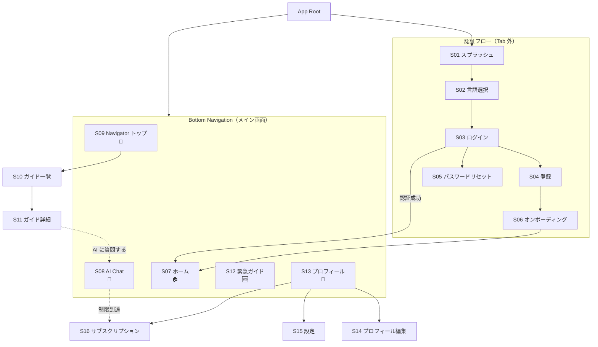

# ユーザーストーリーと要件

## 画面一覧（Phase 0）

| # | 画面名 | パス/ルート | 主な機能 | プラットフォーム |
|---|--------|-----------|---------|---------------|
| S01 | スプラッシュ | `/` (初回) | ロゴ表示 + 言語選択 | Flutter (iOS/Android) |
| S02 | 言語選択 | `/language` | 5言語から選択 | Flutter 全プラットフォーム |
| S03 | ログイン | `/login` | Email/Password ログイン (Firebase Auth) | Flutter 全プラットフォーム |
| S04 | ユーザー登録 | `/register` | Email/Password 登録 (Firebase Auth) | Flutter 全プラットフォーム |
| S05 | パスワードリセット | `/reset-password` | メールでリセットリンク送信 (Firebase Auth) | Flutter 全プラットフォーム |
| S06 | オンボーディング | `/onboarding` | 国籍・在留資格・地域・来日日の入力 | Flutter 全プラットフォーム |
| S07 | ホーム | `/home` | ダッシュボード（クイックアクション、利用状況、Navigator ショートカット） | Flutter 全プラットフォーム |
| S08 | AI Chat | `/chat` | AI チャット画面（テキスト送信 + レスポンス表示） | Flutter 全プラットフォーム |
| S09 | Navigator トップ | `/navigator` | 8 ドメイン一覧（アイコン + ステータス） | Flutter 全プラットフォーム |
| S10 | Navigator ガイド一覧 | `/navigator/:domain` | ドメイン別ガイド一覧 | Flutter 全プラットフォーム |
| S11 | Navigator ガイド詳細 | `/navigator/:domain/:slug` | ガイド全文表示（markdown レンダリング） | Flutter 全プラットフォーム |
| S12 | 緊急ガイド | `/emergency` | 緊急連絡先 + 救急ガイド | Flutter 全プラットフォーム |
| S13 | プロフィール | `/profile` | プロフィール表示 | Flutter 全プラットフォーム |
| S14 | プロフィール編集 | `/profile/edit` | プロフィール情報変更 | Flutter 全プラットフォーム |
| S15 | 設定 | `/settings` | 言語設定、アカウント管理 | Flutter 全プラットフォーム |
| S16 | サブスクリプション | `/subscription` | プラン比較 + 現在のプラン表示 + 購入 | Flutter 全プラットフォーム |

### ~~Phase 0 ピボットで削除された画面~~

| 旧# | 旧画面名 | 代替 |
|-----|---------|------|
| ~~S08~~ | ~~AI チャット一覧~~ | 単一 Chat 画面 (domain 別 session) |
| ~~S09~~ | ~~AI チャット会話~~ | 統合 Chat 画面 |
| ~~S10-12~~ | ~~Banking Navigator 個別画面~~ | Navigator 汎用 UI |
| ~~S13-14~~ | ~~Visa Navigator 個別画面~~ | Navigator 汎用 UI |
| ~~S15-16~~ | ~~Admin Tracker 画面~~ | AI Chat の Tracker 提案に統合 |
| ~~S17-19~~ | ~~Document Scanner 画面~~ | AI Chat 画像入力 (Phase 1) |
| ~~S20-22~~ | ~~Community Q&A 画面~~ | 削除 |
| ~~S23~~ | ~~Medical Guide~~ | Navigator + Emergency |
| ~~S28~~ | ~~LP（ランディングページ）~~ | Phase 0 スコープ外 |

---

## ナビゲーション・アーキテクチャ

> 画面の構造設計。ビジュアル実装（配色・タイポグラフィ・間距・コンポーネントスタイル等）は PM Pipeline の Design Foundation で **Designer が `design/DESIGN_SYSTEM.md` に具体化する**。Architect は構造（Tab 構成・画面階層・導線）のみを定義する。

### Tab 構成（Bottom Navigation）

| # | Tab | アイコン概要 | 含まれる画面 | 設計意図 |
|---|-----|------------|------------|---------|
| 1 | Home | 🏠 ダッシュボード | S07 ホーム | パーソナライズされた入口。クイックアクション + 利用状況表示 |
| 2 | Navigator | 🧭 ガイド | S09 Navigator トップ → S10 ガイド一覧 → S11 ガイド詳細 | 8ドメインの静的ガイド閲覧。SEO 流入口としても機能 |
| 3 | Chat | 💬 AI Chat | S08 AI Chat | プライマリ・インターフェース。中央配置で目立たせる |
| 4 | Emergency | 🆘 緊急 | S12 緊急ガイド | 認証不要。ゲストでも即アクセス可能 |
| 5 | Profile | 👤 設定 | S13 プロフィール → S14 編集, S15 設定, S16 サブスクリプション | アカウント管理 + 課金 |

### 認証状態による Tab アクセス（product-spec §5 Access Boundary 準拠）

| Tab | 🔓 ゲスト | 🔐 ログイン済み |
|-----|:---------:|:--------------:|
| Home | ❌ → 登録/ログイン CTA | ✅ |
| Navigator | ✅（一覧 + Banking 全機能 + 他ドメイン概要+CTA） | ✅（全ガイド） |
| Chat | ❌ → 登録促進画面 | ✅（ティア制限あり） |
| Emergency | ✅ | ✅ |
| Profile | ❌ → ログイン画面 | ✅ |

> ゲストが Chat Tab をタップ → 登録促進画面（「無料登録で AI Chat が使えます — 1日5回まで無料」）を表示。
> Navigator 内の「AI に詳しく聞く」ボタンも同様に登録促進画面へ遷移。

### 画面階層図



### 主要導線

| # | 導線 | ステップ | 設計意図 |
|---|------|---------|---------|
| F1 | 初回登録ユーザー | スプラッシュ → 言語選択 → 登録 → オンボーディング(国籍/在留資格) → ホーム → AI Chat で初回質問 | 登録後 30 秒で AI Chat の価値を体感 |
| F2 | ゲスト導線（未登録） | アプリ起動 → Navigator 一覧 → Banking 詳細ガイド全文閲覧 → Emergency 確認 → 「AI に質問する」CTA → 登録促進画面 | Access Boundary に基づき、登録前に Navigator + Emergency で価値体感 → 登録動機を醸成 |
| F3 | Navigator → Chat 遷移 | Navigator → ドメイン選択 → ガイド閲覧 → 「AI に詳しく聞く」ボタン → Chat 画面（domain hint 付き） | 静的ガイドで基本理解 → AI で個別状況に対応 |
| F4 | 緊急時 | Emergency Tab → 緊急連絡先 + 救急ガイド / Chat Tab → 緊急メッセージ → svc-medical 即時ルーティング | 最短 2 タップで緊急情報にアクセス |
| F5 | Free → 課金 | Chat 5回目完了 → 制限メッセージ + CTA → サブスクリプション画面 → IAP 購入 → 即座に制限解除 | product-spec §5 Access Boundary に基づく転換導線 |

> ⚠️ **ゲスト導線 (F2) の詳細**: product-spec §5 Access Boundary Matrix に基づき、未登録ユーザーでも以下にアクセス可能:
> - Navigator 一覧・概要閲覧（全8ドメイン）
> - Banking 詳細ガイド（全機能無料 — AHA モーメント創出）
> - Medical Emergency Guide（公共安全のため常時公開）
> - Visa/Medical/Admin 等の概要 + CTA（「登録して全文を読む」）
>
> AI Chat・Auto Tracker はログイン必須。ゲストが Chat ボタンを押した場合は登録促進画面にリダイレクト。

### UI Design Language について

> ⚠️ **本文書はナビゲーション構造（画面階層・Tab 構成・導線）のみを定義する。**
> 配色・タイポグラフィ・間距・コンポーネントスタイル等のビジュアル定義は、PM Pipeline の Design Foundation フェーズで **Designer が `design/DESIGN_SYSTEM.md` に具体化する**。
> Architect は Brand Direction（product-spec §4）を参照情報として提供するが、具体的な hex コード・フォント名・px 値は Designer の領域である。

---

## 重要閉ループ

> 各閉ループが跑通（end-to-end 通過）= MVP 機能完成

### 閉ループ A: 初回利用 → AI チャットで問題解決

```
言語選択 → 登録 → オンボーディング(国籍/在留資格入力)
→ ホーム画面 → 「AIに聞く」 → 質問入力 → AI回答表示（ソース引用 + 免責事項）
→ フォローアップ質問 → AI回答 → 「役に立った」実感
```

### 閉ループ B: Navigator でガイド閲覧

```
ホーム → Navigator → ドメイン選択 (Banking) → ガイド一覧
→ 「口座開設ガイド」を選択 → 全文閲覧（必要書類 + 手順）
→ 「AIに質問する」ボタン → Chat 画面に遷移 → 詳細質問
```

### 閉ループ C: 緊急時対応

```
緊急タブ → 緊急連絡先表示 (119, 110)
→ 救急ガイド閲覧 → AI Chat で「救急車を呼びたい」
→ svc-medical が即座に対応手順を回答
```

### 閉ループ D: Free → Standard アップグレード

```
AI チャット 5回目の回答後 →「本日の無料枠を使い切りました」表示
→ 「アップグレード」ボタン → サブスクリプション画面
→ プラン比較 → Standard を選択 → Apple IAP / Google Play で購入
→ 即座に 300回/月の Chat が利用可能に
```

### 閉ループ E: ゲスト導線（未登録ユーザーの価値体験）

```
アプリ起動（未ログイン状態）→ Navigator Tab → ドメイン一覧表示（全8ドメイン）
→ Banking 選択 → ガイド一覧 → 「口座開設ガイド」全文閲覧（ゲストでもアクセス可）
→ Emergency Tab → 緊急連絡先確認（認証不要）
→ 「AI に詳しく聞く」ボタン → 登録促進画面（「無料登録で AI Chat が使えます」）
→ 登録 → オンボーディング → Chat 画面で AI に質問
```

> product-spec §5 Access Boundary Matrix に基づく。Banking 全機能 + Emergency は登録不要で価値を提供し、AI Chat への登録動機を醸成。

---

## ユーザーストーリー

### Epic 0: 認証とオンボーディング

#### US-001: ユーザー登録 [P0] [M]
- **As a** 新規ユーザー
- **I want** メールアドレスとパスワードでアカウントを作成したい
- **So that** アプリの機能を利用できるようになる

**受入条件:**
- Given ユーザーが登録画面にいる
- When 有効なメール + パスワード（8文字以上）を入力して登録ボタンを押す
- Then アカウントが作成され、オンボーディング画面に遷移する

**関連:** 画面: S04 | API: `POST /api/v1/auth/register` | ルール: —

#### US-002: ログイン [P0] [S]
- **As a** 既存ユーザー
- **I want** メールとパスワードでログインしたい
- **So that** 自分のデータにアクセスできる

**受入条件:**
- Given ユーザーがログイン画面にいる
- When 正しい認証情報を入力してログインボタンを押す
- Then ホーム画面に遷移する（オンボーディング未完了なら S06 に遷移）

**関連:** 画面: S03 | API: — (Firebase Auth 直接) | ルール: —

#### US-003: 言語選択 [P0] [S]
- **As a** 初回起動のユーザー
- **I want** アプリの言語を自分の言語に設定したい
- **So that** 理解できる言語で操作できる

**受入条件:**
- Given 初回起動時
- When 5言語 (EN/ZH/VI/KO/PT) から1つを選択する
- Then アプリ全体の UI がその言語に切り替わる

**関連:** 画面: S02 | API: — (ローカル設定) | ルール: DECISIONS.md §2

#### US-004: オンボーディング [P0] [M]
- **As a** 新規登録ユーザー
- **I want** 国籍・在留資格・居住地域・来日日を入力したい
- **So that** パーソナライズされた AI 回答を受け取れる

**受入条件:**
- Given ユーザーがオンボーディング画面にいる
- When 情報を入力して完了ボタンを押す（全フィールド任意、スキップ可能）
- Then プロフィールが更新され、`onboarding_completed = true` になる
- And ホーム画面に遷移する

**関連:** 画面: S06 | API: `POST /api/v1/users/me/onboarding` | ルール: —

#### US-005: ログアウト [P0] [S]
- **As a** ログイン中のユーザー
- **I want** ログアウトしたい
- **So that** 安全にアプリを終了できる

**受入条件:**
- Given ユーザーが設定画面にいる
- When ログアウトボタンを押す
- Then ログイン画面に遷移し、セッションが無効化される

**関連:** 画面: S15 | API: — (Firebase Auth 直接) | ルール: —

#### US-006: パスワードリセット [P1] [S]
- **As a** パスワードを忘れたユーザー
- **I want** メールでパスワードをリセットしたい
- **So that** アカウントに再度アクセスできる

**関連:** 画面: S05 | API: — (Firebase Auth 直接) | ルール: —

---

### Epic 1: AI Chat（コアバリュー）

#### US-101: AI チャット送受信 [P0] [L]
- **As a** ユーザー
- **I want** 自分の言語で質問を入力し、AI の回答を受け取りたい
- **So that** 日本での生活に関する情報を得られる

**受入条件:**
- Given ユーザーが Chat 画面にいる
- When メッセージを送信する
- Then AI の回答が表示される（同期レスポンス）
- And 回答にソース引用が含まれる
- And 免責事項が表示される
- And ドメイン (banking/visa/medical/concierge) が表示される
- And 適切な場合、Tracker 候補が提案される

**関連:** 画面: S08 | API: `POST /api/v1/chat` | ルール: BUSINESS_RULES.md §3, §5

#### US-102: AI Chat ドメインルーティング [P0] [M]
- **As a** ユーザー
- **I want** 質問内容に応じて適切な専門 agent にルーティングされたい
- **So that** 専門的な回答を得られる

**受入条件:**
- Given ユーザーが「銀行口座を開設したい」と入力する
- When メッセージが送信される
- Then svc-banking agent にルーティングされ、banking ドメインの専門回答が返る
- And domain フィールドに "banking" が設定される

**関連:** 画面: S08 | API: `POST /api/v1/chat` | ルール: BUSINESS_RULES.md §3

#### US-103: 緊急メッセージ検出 [P0] [M]
- **As a** 緊急事態のユーザー
- **I want** 「119」「emergency」等のメッセージで即座に医療ガイドを受け取りたい
- **So that** 緊急時に最速で対応できる

**受入条件:**
- Given ユーザーが「119を呼びたい」と入力する
- When メッセージが送信される
- Then keyword 検出で即座に svc-medical にルーティング（LLM 分類をスキップ）
- And 緊急対応手順が回答される

**関連:** 画面: S08 | API: `POST /api/v1/chat` | ルール: BUSINESS_RULES.md §3

#### US-104: AI Chat Free 制限 [P0] [M]
- **As a** Free ユーザー
- **I want** 日次制限に達した時に明確な通知を受け取りたい
- **So that** アップグレードを検討できる

**受入条件:**
- Given Free ユーザーが当日5回目のチャットを完了した
- When 6回目のメッセージを送信しようとする
- Then 429 USAGE_LIMIT_EXCEEDED エラーが返る
- And 残り回数が表示される
- And アップグレード導線が表示される

**関連:** 画面: S08 | API: `POST /api/v1/chat` → 429 | ルール: BUSINESS_RULES.md §2

#### US-105: AI Chat 画像入力 [P1] [L]
- **As a** ユーザー
- **I want** 日本語の書類を写真で送信して翻訳・説明を受けたい
- **So that** 書類の内容を理解できる

**受入条件:**
- Given ユーザーが Chat 画面にいる
- When 画像を添付してメッセージを送信する
- Then AI が画像の内容を解読し、翻訳・説明を回答する

**関連:** 画面: S08 | API: `POST /api/v1/chat` (image フィールド) | ルール: —

---

### Epic 2: Navigator（8 ドメイン）

#### US-201: Navigator ドメイン一覧 [P0] [M]
- **As a** ユーザー
- **I want** 全ドメインの一覧を確認したい
- **So that** 関心のある分野のガイドを探せる

**受入条件:**
- Given ユーザーが Navigator 画面にいる
- When 画面を表示する
- Then 8 ドメインがアイコン + ステータス (active/coming_soon) で表示される
- And active ドメインのガイド数が表示される
- And 認証不要で閲覧可能

**関連:** 画面: S09 | API: `GET /api/v1/navigator/domains` | ルール: BUSINESS_RULES.md §4

#### US-202: Navigator ガイド一覧 [P0] [M]
- **As a** ユーザー
- **I want** 特定ドメインのガイド一覧を見たい
- **So that** 必要な情報を探せる

**受入条件:**
- Given ユーザーが Banking ドメインを選択した
- When ガイド一覧画面を表示する
- Then banking knowledge ファイルの一覧がタイトル + サマリーで表示される
- And coming_soon ドメインは「準備中」と表示される

**関連:** 画面: S10 | API: `GET /api/v1/navigator/{domain}/guides` | ルール: —

#### US-203: Navigator ガイド詳細 [P0] [L]
- **As a** ユーザー
- **I want** ガイドの全文を読みたい
- **So that** 詳細な情報を得られる

**受入条件:**
- Given ユーザーがガイドを選択した
- When 詳細画面を表示する
- Then markdown 形式のガイド全文が表示される
- And 「AI に質問する」ボタンが表示される（Chat 画面への遷移）

**関連:** 画面: S11 | API: `GET /api/v1/navigator/{domain}/guides/{slug}` | ルール: —

---

### Epic 3: 緊急ガイド

#### US-301: 緊急連絡先・救急ガイド [P0] [M]
- **As a** ユーザー
- **I want** 緊急時の連絡先と対処法をすぐに確認したい
- **So that** 緊急事態に対応できる

**受入条件:**
- Given ユーザーが Emergency 画面にいる（認証不要）
- When 画面を表示する
- Then 110, 119, #7119 等の緊急連絡先が表示される
- And 救急車の呼び方ガイドが表示される
- And 免責事項が表示される

**関連:** 画面: S12 | API: `GET /api/v1/emergency` | ルール: BUSINESS_RULES.md §5

---

### Epic 4: サブスクリプション

#### US-401: プラン比較表示 [P0] [S]
- **As a** ユーザー
- **I want** Free / Standard / Premium の違いを比較したい
- **So that** アップグレードの判断ができる

**受入条件:**
- Given ユーザーがサブスクリプション画面にいる
- When 画面を表示する
- Then 3 プラン + 従量チャージの比較表と料金が表示される
- And 現在のプランがハイライトされる

**関連:** 画面: S16 | API: `GET /api/v1/subscription/plans` | ルール: —

#### US-402: サブスクリプション購入 [P0] [L]
- **As a** Free ユーザー
- **I want** Standard または Premium を購入したい
- **So that** 制限なく Chat を利用できる

**受入条件:**
- Given ユーザーがサブスクリプション画面でプランを選択する
- When 購入ボタンを押す
- Then Apple IAP / Google Play Billing の購入画面が表示される
- When 支払いを完了する
- Then 即座にアップグレード後の機能が開放される
- And profiles.subscription_tier が更新される

**関連:** 画面: S16 | API: `POST /api/v1/subscription/purchase` | ルール: BUSINESS_RULES.md §6

#### US-403: サブスクリプション管理 [P1] [S]
- **As a** 有料ユーザー
- **I want** サブスクリプションの状態確認とキャンセルがしたい
- **So that** 課金を管理できる

**関連:** 画面: S16 | API: `GET /api/v1/usage` | ルール: BUSINESS_RULES.md §6

---

### Epic 5: プロフィール・設定

#### US-501: プロフィール編集 [P1] [S]
- **As a** ユーザー
- **I want** 国籍や在留資格等のプロフィールを変更したい
- **So that** AI 回答のパーソナライズ精度を上げられる

**関連:** 画面: S14 | API: `PATCH /api/v1/users/me` | ルール: —

#### US-502: 言語変更 [P1] [S]
- **As a** ユーザー
- **I want** アプリの表示言語を変更したい
- **So that** 他の言語で利用できる

**関連:** 画面: S15 | API: `PATCH /api/v1/users/me` | ルール: —

#### US-503: アカウント削除 [P2] [M]
- **As a** ユーザー
- **I want** アカウントを削除したい
- **So that** 個人情報が消去される

**関連:** 画面: S15 | API: `POST /api/v1/auth/delete-account` | ルール: —

---

## ~~Phase 0 ピボットで削除された Epic~~

| 旧 Epic | 旧ストーリー | 理由 |
|---------|------------|------|
| ~~Epic 2: Banking Navigator (専用UI)~~ | US-201~203 | Navigator 汎用 UI に統合 |
| ~~Epic 3: Visa Navigator (専用UI)~~ | US-301~302 | Navigator 汎用 UI に統合 |
| ~~Epic 4: Admin Tracker~~ | US-401~403 | AI Chat Tracker 提案に簡素化 |
| ~~Epic 5: Document Scanner~~ | US-501~502 | AI Chat 画像入力に統合 (Phase 1) |
| ~~Epic 6: Community Q&A~~ | US-601~603 | 削除 |
| ~~Epic 8: Medical Guide (専用UI)~~ | US-801~802 | Navigator + Emergency に統合 |
| ~~Epic 10: LP（Web）~~ | US-1001 | Phase 0 スコープ外 |

---

## 変更履歴

- 2026-02-16: 初版作成
- 2026-02-17: Phase 0 アーキテクチャピボット反映（OC Runtime / memory_search / LLM routing / 課金体系更新）
- 2026-02-18: strategy/ 連携補完（Navigation Architecture / ゲスト導線 / UI Design Language 注記）
